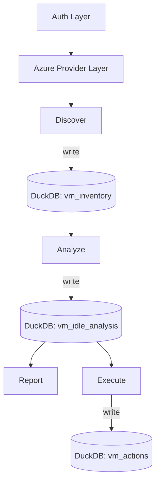

# ARCHITECTURE.md — DevFinOps (dfo)

This document describes the architecture of the DevFinOps (dfo) MVP and its evolution.  
It reflects the system components, their interactions, data flow, and the guiding principles behind the design.

---

# 1. Architectural Overview

The DevFinOps (dfo) toolkit follows a modular, layered architecture with clear separation of responsibilities:

```
auth → discover → analyze → report → execute
                 ↓         ↓         ↓
               DuckDB ←——— analysis ←—— actions
```

Each stage is isolated, testable, and designed for future automation.

---

# 2. High-Level Component Layout

```
dfo/
  cli/            – Typer CLI, user entrypoints
  core/           – config, auth, shared models
  providers/      – cloud provider SDK integrations
    azure/        – Azure-specific client and service wrappers
  discover/       – inventory building (reads from provider, writes to DuckDB)
  analyze/        – FinOps logic (reads inventory, writes analysis)
  report/         – console/JSON/HTML reporting (reads from DuckDB)
  execute/        – applies remediations (reads from DuckDB, writes back)
  db/             – DuckDB engine, schema, helpers
  config/         – settings schema and documentation
  tests/          – test suite structure
```

This structure keeps the system easy to extend (AWS, GCP) without major refactoring.

---

# 3. Core Layers

## 3.1 Authentication Layer
The auth layer abstracts Azure authentication using:

- Service Principal credentials  
- OR `DefaultAzureCredential` fallback  

It returns a credential object consumed by provider clients.

**Responsibilities**
- Load credentials from environment
- Initialize Azure identity objects
- Expose `get_azure_credential()`

**Not responsible for**
- Resource access  
- Discovery logic  
- Data manipulation  

---

## 3.2 Provider Layer (Azure SDK Integration)

The provider layer maps cloud service APIs into clean Python functions.  
Azure SDK modules are split along major service boundaries:

- `client.py` – constructs Azure clients
- `compute.py` – VM listing, metadata
- `monitor.py` – CPU metrics
- `cost.py` – cost estimation helper
- `advisor.py` – future rightsizing support
- `resource_graph.py` – future multi-inventory queries

**Responsibilities**
- Wrap Azure SDK calls
- Normalize raw output
- Provide reusable building blocks to upper layers

**Not responsible for**
- Data storage  
- Analysis logic  
- Reporting  

---

# 4. Data Lifecycle Architecture

## 4.1 DuckDB Storage Layer

DuckDB acts as the local storage and processing backend:

### Tables:
- `vm_inventory` – raw discovery output  
- `vm_idle_analysis` – analysis results  
- `vm_actions` – execution logs  

### Benefits:
- Zero external dependencies  
- High analytical performance  
- Portable and versionable  
- Seamless integration with Python  

### Data Flow:
```
discover → vm_inventory
analyze  → vm_idle_analysis
execute  → vm_actions
report   → reads vm_idle_analysis
```

---

# 5. Processing Stages

## 5.1 Discovery Stage
Collects raw Azure VM metadata and CPU metrics.

**Reads:**
- Azure SDK (compute + monitor)

**Writes:**
- `vm_inventory` in DuckDB

---

## 5.2 Analysis Stage
Evaluates VM usage patterns to detect idle resources.

**Reads:**
- `vm_inventory`

**Writes:**
- `vm_idle_analysis`

**Logic Includes:**
- CPU average vs threshold  
- Days underutilized  
- Estimated monthly savings  
- Severity level  
- Recommended action  

---

## 5.3 Reporting Stage
Generates reports for human and machine consumption.

**Reads:**
- `vm_idle_analysis`

**Outputs:**
- Rich console tables  
- JSON  

Future:
- HTML, CSV, charts, dashboards  

---

## 5.4 Execution Stage
Executes actions on cloud resources (safe by default).

**Reads:**
- `vm_idle_analysis`  
- CLI flags (dry-run, yes)

**Writes:**
- `vm_actions`

Actions include:
- Stop/deallocate VMs  
- Skipping or noting exceptions  

---

# 6. CLI Architecture

Powered by **Typer**, the CLI follows cloud-first grouping:

```
dfo azure discover vms
dfo azure analyze idle-vms
dfo azure report idle-vms
dfo azure execute stop-idle-vms
```

CLI layer orchestrates discovery/analyze/report/execute using DuckDB as the shared state.

---

# 7. Extensibility Patterns

## 7.1 Adding New Providers (AWS, GCP)
Each provider mirrors Azure:

```
providers/aws/compute.py
providers/aws/monitor.py
...
```

Analyzers remain cloud-agnostic.

## 7.2 Adding New Analyzers
New analyzers follow the read → analyze → write DuckDB pattern.

Examples:
- Rightsizing
- Storage optimization
- Networking cleanup
- Commitments utilization

## 7.3 Introducing Pipelines (Phase 4)
A declarative YAML pipeline will orchestrate:

```
auth → discover → analyze → report → execute
```

Including scheduling, skipping, or chaining.

---

# 8. Architecture Diagram (Mermaid)



---

# 9. Guiding Principles

- **Modularity:** Each layer is isolated and testable  
- **Extensibility:** Easy to add clouds, analyzers, and reports  
- **Local-first:** DuckDB enables fast iteration without infra  
- **CLI-first:** Everything accessible via commands  
- **Deterministic:** All stages read/write predictable tables  
- **Safety:** Execution requires opt-in (`--yes`)  

---

# 10. Future Architecture (Beyond MVP)

### Automation Pipeline
- YAML-driven
- Schedules for repeated runs
- Conditional execution

### Web Dashboard + REST API
- Visual insights  
- CRUD for analysis + actions  
- Integration with enterprise pipelines  

### LLM FinOps Assistant
- Summaries
- Recommendations
- Natural-language queries against DuckDB  

### Policy-as-Code
- enforcement rules
- resource governance
- CI/CD integrations  

---

This architecture ensures the dfo toolkit can grow from a CLI-based MVP into a robust, multi-cloud, automated FinOps platform.
