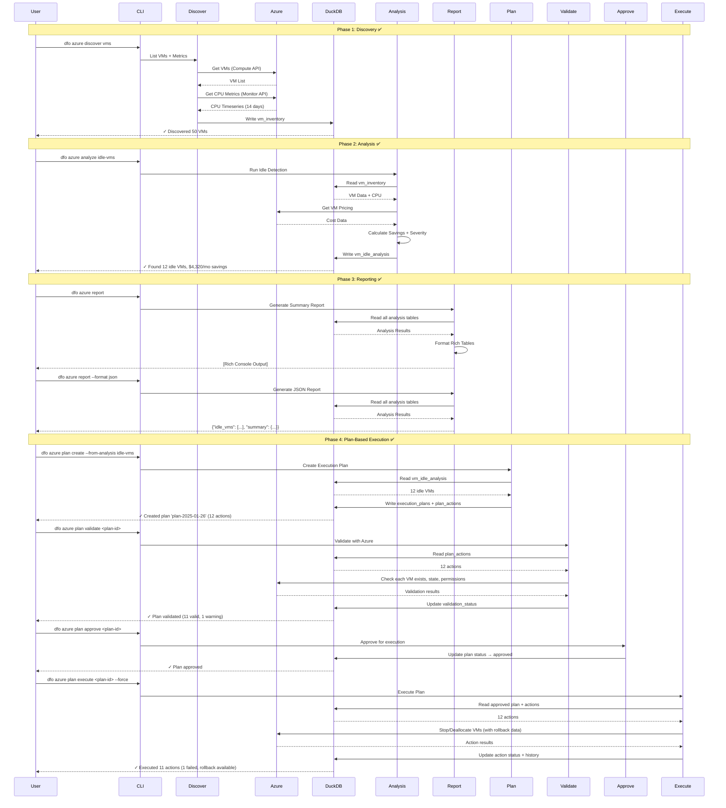
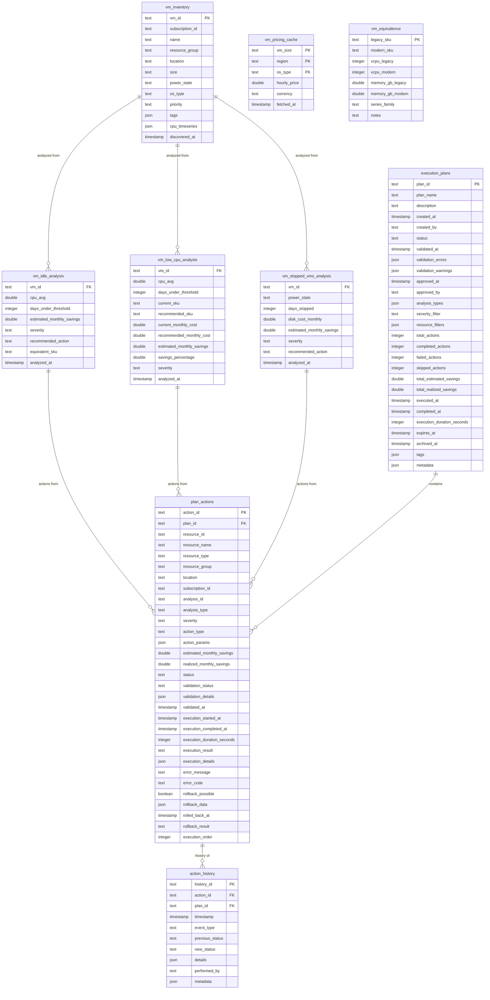
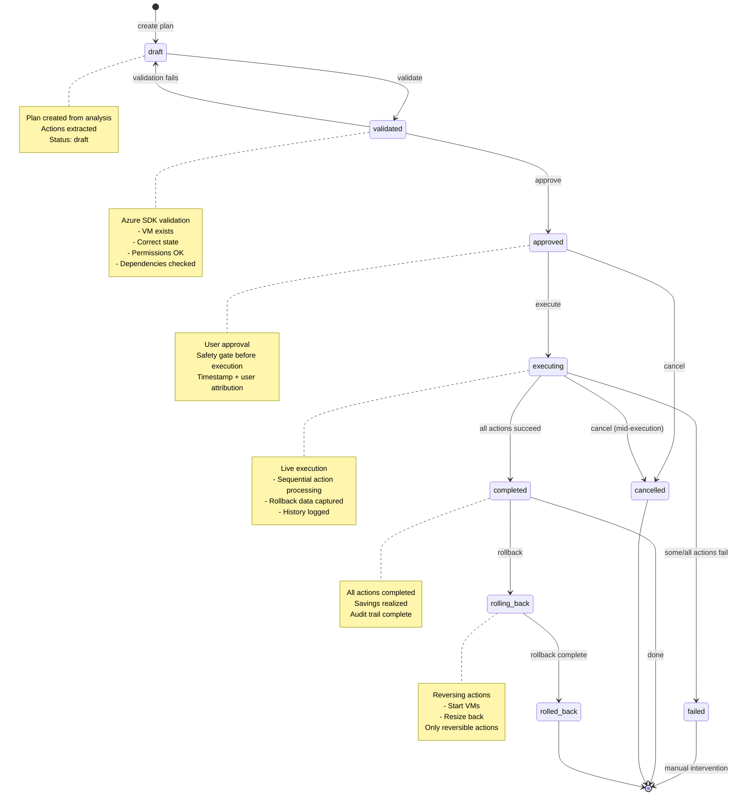

# DFO Architecture

> **Version:** v0.2.0 (Phase 1 MVP Complete)
> **Last Updated:** 2025-01-26
> **Status:** ✅ Production-Ready

This document describes the complete architecture of the dfo (DevFinOps) toolkit, including all implemented components, data flows, and design principles.

---

## Table of Contents

1. [Architectural Overview](#architectural-overview)
2. [System Architecture Diagram](#system-architecture-diagram)
3. [Layer Architecture](#layer-architecture)
4. [Data Flow Pipeline](#data-flow-pipeline)
5. [Database Schema](#database-schema)
6. [Command Architecture](#command-architecture)
7. [Execution System Architecture](#execution-system-architecture)
8. [Extensibility Patterns](#extensibility-patterns)
9. [Design Principles](#design-principles)
10. [Future Architecture](#future-architecture)

---

## Architectural Overview

The dfo toolkit follows a **modular, layered architecture** with clear separation of responsibilities and strict data flow direction.

### Core Pipeline

```
auth → discover → analyze → report → execute
                 ↓         ↓         ↓
               DuckDB ←——— analysis ←—— actions
```

**Key Characteristics:**
- **Modular** - Each layer is isolated and independently testable
- **Local-first** - DuckDB eliminates need for external infrastructure
- **CLI-driven** - All functionality accessible via command line
- **Type-safe** - Pydantic models ensure data integrity
- **Extensible** - Easy to add new cloud providers and analyzers

---

## System Architecture Diagram

### Complete System Overview

```mermaid
graph TB
    subgraph "CLI Layer"
        CLI[dfo CLI Entry Point<br/>cli.py]
        CMD_AZURE[Azure Commands<br/>cmd/azure.py]
        CMD_RULES[Rules Commands<br/>cmd/rules.py]
        CMD_DB[DB Commands<br/>cmd/db.py]
        CMD_CONFIG[Config Commands<br/>cmd/config.py]
        CMD_VERSION[Version Commands<br/>cmd/version.py]
    end

    subgraph "Core Layer"
        CONFIG[Configuration<br/>core/config.py<br/>Pydantic Settings]
        AUTH[Authentication<br/>core/auth.py<br/>Azure Credentials]
        MODELS[Data Models<br/>core/models.py<br/>Pydantic Models]
    end

    subgraph "Rules Engine"
        RULES[Rule Engine<br/>rules/__init__.py]
        VM_RULES[VM Rules<br/>vm_rules.json<br/>29 rules]
        STORAGE_RULES[Storage Rules<br/>storage_rules.json<br/>15 rules]
    end

    subgraph "Provider Layer - Azure SDK Integration"
        PROVIDER_CLIENT[Client Factory<br/>providers/azure/client.py]
        PROVIDER_COMPUTE[Compute Client<br/>providers/azure/compute.py]
        PROVIDER_MONITOR[Monitor Client<br/>providers/azure/monitor.py]
        PROVIDER_PRICING[Pricing API<br/>providers/azure/pricing.py]
    end

    subgraph "Discovery Layer - ✅ COMPLETE"
        DISCOVER_VMS[VM Discovery<br/>discover/vms.py<br/>List VMs + CPU Metrics]
    end

    subgraph "Analysis Layer - ✅ COMPLETE"
        ANALYZE_IDLE[Idle VM Analysis<br/>analyze/idle_vms.py<br/>CPU + Cost + Severity]
        ANALYZE_LOW_CPU[Low-CPU Analysis<br/>analyze/low_cpu.py<br/>Rightsizing]
        ANALYZE_STOPPED[Stopped VMs<br/>analyze/stopped_vms.py<br/>30+ days stopped]
        ANALYZE_MAPPER[SKU Mapper<br/>analyze/compute_mapper.py<br/>Legacy → Modern SKUs]
    end

    subgraph "Report Layer - ✅ COMPLETE"
        REPORT_COLLECTORS[Data Collectors<br/>report/collectors.py]
        REPORT_CONSOLE[Console Formatter<br/>report/formatters/console.py<br/>Rich Tables]
        REPORT_JSON[JSON Formatter<br/>report/formatters/json_formatter.py]
        REPORT_CSV[CSV Formatter<br/>report/formatters/csv_formatter.py]
    end

    subgraph "Execution Layer - ✅ COMPLETE"
        EXEC_PLAN[Plan Manager<br/>execute/plan_manager.py]
        EXEC_VALIDATOR[Validators<br/>execute/validators.py]
        EXEC_AZURE_VAL[Azure Validator<br/>execute/azure_validator.py]
        EXEC_APPROVAL[Approval Workflow<br/>execute/approvals.py]
        EXEC_ENGINE[Execution Engine<br/>execute/execution.py]
        EXEC_AZURE[Azure Executor<br/>execute/azure_executor.py]
        EXEC_ROLLBACK[Rollback Manager<br/>execute/rollback.py]
    end

    subgraph "Database Layer - DuckDB"
        DB_MANAGER[DuckDB Manager<br/>db/duck.py]
        DB_SCHEMA[Schema Definition<br/>db/schema.sql]

        subgraph "Discovery Tables"
            TABLE_INVENTORY[(vm_inventory<br/>VM metadata + CPU data)]
        end

        subgraph "Analysis Tables"
            TABLE_IDLE[(vm_idle_analysis<br/>Idle VMs)]
            TABLE_LOW_CPU[(vm_low_cpu_analysis<br/>Rightsizing)]
            TABLE_STOPPED[(vm_stopped_vms_analysis<br/>Stopped VMs)]
        end

        subgraph "Execution Tables"
            TABLE_PLANS[(execution_plans<br/>Execution plans)]
            TABLE_ACTIONS[(plan_actions<br/>Individual actions)]
            TABLE_HISTORY[(action_history<br/>Audit trail)]
        end

        subgraph "Cache Tables"
            TABLE_PRICING[(vm_pricing_cache<br/>Cost data)]
            TABLE_EQUIV[(vm_equivalence<br/>SKU mappings)]
        end
    end

    %% CLI to Commands
    CLI --> CMD_AZURE
    CLI --> CMD_RULES
    CLI --> CMD_DB
    CLI --> CMD_CONFIG
    CLI --> CMD_VERSION

    %% Commands use Core
    CMD_AZURE --> CONFIG
    CMD_AZURE --> AUTH
    CMD_AZURE --> MODELS
    CMD_RULES --> RULES

    %% Rules Engine
    RULES --> VM_RULES
    RULES --> STORAGE_RULES

    %% Provider Layer
    AUTH --> PROVIDER_CLIENT
    PROVIDER_CLIENT --> PROVIDER_COMPUTE
    PROVIDER_CLIENT --> PROVIDER_MONITOR
    CONFIG --> PROVIDER_PRICING

    %% Database Layer
    DB_MANAGER --> DB_SCHEMA
    DB_MANAGER --> TABLE_INVENTORY
    DB_MANAGER --> TABLE_IDLE
    DB_MANAGER --> TABLE_LOW_CPU
    DB_MANAGER --> TABLE_STOPPED
    DB_MANAGER --> TABLE_PLANS
    DB_MANAGER --> TABLE_ACTIONS
    DB_MANAGER --> TABLE_HISTORY
    DB_MANAGER --> TABLE_PRICING
    DB_MANAGER --> TABLE_EQUIV

    %% Discovery Flow
    CMD_AZURE -->|discover vms| DISCOVER_VMS
    DISCOVER_VMS --> PROVIDER_COMPUTE
    DISCOVER_VMS --> PROVIDER_MONITOR
    DISCOVER_VMS --> TABLE_INVENTORY

    %% Analysis Flow
    CMD_AZURE -->|analyze idle-vms| ANALYZE_IDLE
    CMD_AZURE -->|analyze low-cpu| ANALYZE_LOW_CPU
    CMD_AZURE -->|analyze stopped-vms| ANALYZE_STOPPED
    ANALYZE_IDLE --> TABLE_INVENTORY
    ANALYZE_IDLE --> PROVIDER_PRICING
    ANALYZE_IDLE --> TABLE_IDLE
    ANALYZE_LOW_CPU --> TABLE_INVENTORY
    ANALYZE_LOW_CPU --> ANALYZE_MAPPER
    ANALYZE_LOW_CPU --> TABLE_LOW_CPU
    ANALYZE_STOPPED --> TABLE_INVENTORY
    ANALYZE_STOPPED --> TABLE_STOPPED

    %% Report Flow
    CMD_AZURE -->|report| REPORT_COLLECTORS
    REPORT_COLLECTORS --> TABLE_IDLE
    REPORT_COLLECTORS --> TABLE_LOW_CPU
    REPORT_COLLECTORS --> TABLE_STOPPED
    REPORT_COLLECTORS --> REPORT_CONSOLE
    REPORT_COLLECTORS --> REPORT_JSON
    REPORT_COLLECTORS --> REPORT_CSV

    %% Execute Flow
    CMD_AZURE -->|plan create| EXEC_PLAN
    CMD_AZURE -->|plan validate| EXEC_VALIDATOR
    CMD_AZURE -->|plan approve| EXEC_APPROVAL
    CMD_AZURE -->|plan execute| EXEC_ENGINE
    CMD_AZURE -->|plan rollback| EXEC_ROLLBACK
    EXEC_PLAN --> TABLE_IDLE
    EXEC_PLAN --> TABLE_LOW_CPU
    EXEC_PLAN --> TABLE_STOPPED
    EXEC_PLAN --> TABLE_PLANS
    EXEC_PLAN --> TABLE_ACTIONS
    EXEC_VALIDATOR --> EXEC_AZURE_VAL
    EXEC_AZURE_VAL --> PROVIDER_COMPUTE
    EXEC_ENGINE --> EXEC_AZURE
    EXEC_AZURE --> PROVIDER_COMPUTE
    EXEC_ENGINE --> TABLE_HISTORY

    classDef implemented fill:#90EE90,stroke:#2E7D32,stroke-width:2px
    classDef infrastructure fill:#87CEEB,stroke:#1565C0,stroke-width:2px

    class DISCOVER_VMS,ANALYZE_IDLE,ANALYZE_LOW_CPU,ANALYZE_STOPPED,ANALYZE_MAPPER,REPORT_COLLECTORS,REPORT_CONSOLE,REPORT_JSON,REPORT_CSV,EXEC_PLAN,EXEC_VALIDATOR,EXEC_AZURE_VAL,EXEC_APPROVAL,EXEC_ENGINE,EXEC_AZURE,EXEC_ROLLBACK implemented
    class DB_MANAGER,TABLE_INVENTORY,TABLE_IDLE,TABLE_LOW_CPU,TABLE_STOPPED,TABLE_PLANS,TABLE_ACTIONS,TABLE_HISTORY,TABLE_PRICING,TABLE_EQUIV infrastructure
```



---

## Layer Architecture

### Directory Structure

```
dfo/
├── cli.py                 # Main CLI entry point (assembles all commands)
├── cmd/                   # CLI command modules (modular organization)
│   ├── version.py        # Version command
│   ├── config.py         # Config command
│   ├── db.py             # Database management commands
│   └── azure.py          # Azure commands (1,605 lines - orchestration)
├── core/                  # Config, auth, shared models
│   ├── config.py         # Pydantic settings
│   ├── auth.py           # Azure authentication
│   └── models.py         # Pydantic data models
├── providers/             # Cloud provider SDK integrations
│   └── azure/            # Azure SDK wrappers
│       ├── client.py     # Client factory
│       ├── compute.py    # VM operations
│       ├── monitor.py    # Metrics retrieval
│       └── pricing.py    # Azure Pricing API
├── discover/              # Inventory building
│   └── vms.py            # VM discovery + CPU metrics
├── analyze/               # FinOps analysis logic
│   ├── idle_vms.py       # Idle VM detection (<5% CPU)
│   ├── low_cpu.py        # Rightsizing (<20% CPU)
│   ├── stopped_vms.py    # Stopped VMs (30+ days)
│   └── compute_mapper.py # SKU equivalence mapping
├── report/                # Multi-format reporting
│   ├── collectors.py     # Data collection from DB
│   ├── models.py         # Report data models
│   ├── console.py        # Console output orchestration
│   ├── json_report.py    # JSON output orchestration
│   └── formatters/       # Format-specific formatters
│       ├── console.py    # Rich console tables
│       ├── json_formatter.py  # JSON serialization
│       └── csv_formatter.py   # CSV export
├── execute/               # Plan-based execution system
│   ├── models.py         # Plan and action models
│   ├── plan_manager.py   # Plan CRUD operations
│   ├── validators.py     # Generic validation logic
│   ├── azure_validator.py # Azure-specific validation
│   ├── approvals.py      # Approval workflow
│   ├── execution.py      # Execution engine
│   ├── azure_executor.py # Azure SDK execution
│   └── rollback.py       # Rollback manager
├── inventory/             # VM inventory queries
│   ├── queries.py        # Search, filter, sort
│   └── formatters.py     # Inventory output formatting
├── db/                    # DuckDB engine
│   ├── duck.py           # DuckDB manager
│   └── schema.sql        # Database schema
├── common/                # Shared utilities
│   ├── visualizations.py # Charts and graphs
│   └── terminal.py       # Terminal utilities
└── tests/                 # Test suite (589 tests)
    ├── conftest.py       # Shared fixtures
    ├── test_core_*.py
    ├── test_providers_*.py
    ├── test_discover_*.py
    ├── test_analyze_*.py
    ├── test_report_*.py
    ├── test_execute_*.py
    └── test_cmd_*.py
```

### Layer Responsibilities

| Layer | Must Do | Must NOT Do | Test Coverage |
|-------|---------|-------------|---------------|
| **core** | Config, auth, models | Provider calls, DB writes | 100% |
| **providers** | Cloud SDK calls only | Analysis, DB writes | 85-100% |
| **discover** | Collect raw data → DB | Analysis logic | 100% |
| **analyze** | Pure FinOps logic | Cloud calls, direct DB writes | 89-94% |
| **report** | Render outputs | Analysis, cloud calls | 98% |
| **execute** | Apply actions → DB | Discovery | 92% |
| **inventory** | Query VM data | Analysis, actions | 91-100% |
| **db** | Read/write DuckDB only | Cloud logic, analysis | 92% |
| **cli/cmd** | Orchestrate commands | Business logic | 32-88% |

**Overall Test Coverage:** 70%+ (589 passing tests)

### Layer Dependencies (No Circular Imports)

```
cli → cmd → {discover, analyze, report, execute, inventory}
              ↓         ↓         ↓         ↓         ↓
          providers  rules    db      models    db
              ↓
            core
```

**Rules:**
- Each layer can only import from layers to its left or below
- DuckDB is the contract between stages
- No layer calls "sideways" to peer layers

---

## Data Flow Pipeline

### End-to-End Pipeline Sequence



### Data Flow Summary

```
Stage 1: Azure APIs → Discovery → vm_inventory (DuckDB)
Stage 2: vm_inventory → Analysis → vm_*_analysis (DuckDB)
Stage 3: vm_*_analysis → Report → Console/JSON/CSV Output
Stage 4: vm_*_analysis → Plan → execution_plans + plan_actions (DuckDB)
Stage 5: execution_plans → Validation → Azure SDK → validation results
Stage 6: execution_plans → Execution → Azure SDK → action_history (DuckDB)
```

---

## Database Schema

### Entity Relationship Diagram



### Table Categories

**Discovery Tables:**
- `vm_inventory` - Raw VM discovery data + CPU metrics

**Analysis Tables:**
- `vm_idle_analysis` - Idle VM detection results
- `vm_low_cpu_analysis` - Rightsizing opportunities
- `vm_stopped_vms_analysis` - Stopped VMs (30+ days)

**Execution Tables:**
- `execution_plans` - Execution plans with status workflow
- `plan_actions` - Individual actions within plans
- `action_history` - Complete audit trail

**Cache Tables:**
- `vm_pricing_cache` - Azure pricing data (TTL-based)
- `vm_equivalence` - Legacy to modern SKU mappings

---

## Command Architecture

### All Available Commands

```bash
# Database Management
dfo db init                       # Initialize database
dfo db refresh                    # Drop and recreate tables
dfo db info                       # Show database stats

# Configuration
dfo config                        # Show config (secrets masked)
dfo config --show-secrets         # Show config (unmasked)
dfo version                       # Show version

# Discovery
dfo azure discover vms            # Discover VMs + CPU metrics

# Inventory Browse
dfo azure list                    # List all VMs
dfo azure list --power-state running  # Filter by power state
dfo azure list --sort-by size     # Sort by VM size
dfo azure show <vm-name>          # Show VM details
dfo azure search <query>          # Search VMs by name/tags

# Analysis
dfo azure analyze idle-vms        # Detect idle VMs (<5% CPU)
dfo azure analyze low-cpu         # Detect rightsizing opportunities
dfo azure analyze stopped-vms     # Detect stopped VMs (30+ days)
dfo azure analyze --list          # List all available analyses

# Reporting
dfo azure report                  # Summary view (default)
dfo azure report --by-rule idle-vms    # Rule-specific view
dfo azure report --by-resource <vm>    # Single VM view
dfo azure report --all-resources       # All VMs with findings
dfo azure report --format json         # JSON export
dfo azure report --format csv          # CSV export
dfo azure report --severity high       # Filter by severity
dfo azure report --limit 10            # Limit results
dfo azure report --output report.json  # Save to file

# Plan Management (Execution System)
dfo azure plan create --from-analysis idle-vms  # Create plan from analysis
dfo azure plan list                              # List all plans
dfo azure plan list --status approved            # Filter by status
dfo azure plan show <plan-id>                    # Show plan summary
dfo azure plan show <plan-id> --detail           # Show plan with actions
dfo azure plan validate <plan-id>                # Validate with Azure
dfo azure plan approve <plan-id>                 # Approve for execution
dfo azure plan execute <plan-id>                 # Dry-run (default, safe)
dfo azure plan execute <plan-id> --force         # Live execution (WARNING!)
dfo azure plan status <plan-id>                  # Check execution status
dfo azure plan status <plan-id> --verbose        # Detailed status
dfo azure plan rollback <plan-id>                # Rollback simulation
dfo azure plan rollback <plan-id> --force        # Live rollback
dfo azure plan delete <plan-id> --force          # Delete plan

# Rules Management
dfo rules list                    # List all rules
dfo rules list --enabled          # List enabled rules only
dfo rules show <rule-key>         # Show rule details
dfo rules validate                # Validate rules files
dfo rules services                # List service types
dfo rules keys                    # List all rule CLI keys
dfo rules categories              # List all categories
```

**Total Commands:** 35+ commands across 6 command groups

---

## Execution System Architecture

### Plan-Based Execution Workflow

The execution system implements a **plan-based workflow** with validation, approval, and rollback capabilities.

#### State Machine



#### Execution Components

**1. Plan Manager** (`execute/plan_manager.py`)
- Plan CRUD operations
- Status transitions
- Metrics tracking
- Plan filtering and search

**2. Validators** (`execute/validators.py`, `execute/azure_validator.py`)
- Generic validation logic
- Azure-specific checks:
  - VM exists
  - VM in correct state
  - Sufficient permissions
  - No blocking dependencies

**3. Approval Workflow** (`execute/approvals.py`)
- Safety gates
- User attribution (approved_by)
- Stale validation detection
- Approval expiration

**4. Execution Engine** (`execute/execution.py`, `execute/azure_executor.py`)
- Dry-run mode (default, safe)
- Live execution (--force flag required)
- Sequential action processing
- Error handling and recovery
- Rollback data capture

**5. Rollback Manager** (`execute/rollback.py`)
- Reversibility checks
- Rollback simulation
- Live rollback execution
- Supported reversible actions:
  - Stop → Start
  - Deallocate → Start
  - Downsize → Upsize (resize)

**6. Audit Trail** (`action_history` table)
- Complete event history
- Status transitions
- Execution results
- User attribution

#### Execution Safety Features

**Safety by Default:**
- Dry-run is the default mode (no --force flag = no changes)
- Validation required before approval
- Approval required before execution
- Stale validation detection (re-validate if >1 hour old)

**Rollback Capability:**
- Rollback data captured during execution
- Reversible actions identified
- Dry-run rollback simulation
- Live rollback with --force

**Audit Trail:**
- Complete history in `action_history` table
- User attribution for approvals/executions
- Timestamps for all state transitions
- Execution results and error messages

---

## Extensibility Patterns

### Adding New Cloud Providers

**Pattern: Parallel Provider Structure**

```
providers/
├── azure/             # ✅ Implemented
│   ├── client.py
│   ├── compute.py
│   ├── monitor.py
│   └── pricing.py
├── aws/               # 📋 Planned (Phase 3)
│   ├── client.py
│   ├── compute.py
│   ├── monitor.py
│   └── pricing.py
└── gcp/               # 📋 Future
    ├── client.py
    ├── compute.py
    ├── monitor.py
    └── pricing.py
```

**Key Point:** Analyzers remain cloud-agnostic. Only discovery layer is provider-specific.

### Adding New Analyzers

**Pattern: Read → Analyze → Write DuckDB**

1. Create analysis module: `analyze/new_analyzer.py`
2. Create DB table: `vm_new_analysis` or `<resource>_new_analysis`
3. Read from inventory table
4. Apply analysis logic
5. Write to analysis table
6. Create corresponding report formatter
7. Add CLI command in `cmd/azure.py`

**Examples:**
- Rightsizing (implemented: `analyze/low_cpu.py`)
- Stopped VMs (implemented: `analyze/stopped_vms.py`)
- Storage optimization (planned: `analyze/storage_tiering.py`)
- Networking cleanup (future)

### Adding New Report Formats

**Pattern: Collector → Formatter**

1. Create formatter: `report/formatters/new_format.py`
2. Implement format method
3. Add format to CLI: `cmd/azure.py::report`
4. Add tests: `test_report_formatters_new_format.py`

**Examples:**
- HTML reports (future)
- PDF reports (future)
- Excel exports (future)

---

## Design Principles

### 1. Modularity
- **Each layer is isolated** - Can be tested independently
- **Clear interfaces** - Pydantic models between layers
- **Single responsibility** - One purpose per module/class/function

### 2. Extensibility
- **Easy to add clouds** - Parallel provider structure
- **Easy to add analyzers** - Standard read-analyze-write pattern
- **Easy to add reports** - Pluggable formatters

### 3. Local-First
- **DuckDB eliminates infrastructure** - No external database required
- **Fast iteration** - All data local
- **Portable** - Database is a single file
- **Versionable** - Can commit database to git (for testing)

### 4. CLI-First
- **Everything accessible via commands** - No GUI required
- **Automation-friendly** - Can script all operations
- **Pipeline-ready** - Designed for CI/CD integration

### 5. Safety-First
- **Dry-run default** - No changes without explicit --force
- **Validation before execution** - Check everything first
- **Approval workflow** - User must approve
- **Rollback capability** - Can undo actions

### 6. Type-Safety
- **Pydantic models** - All cross-layer data is typed
- **Type hints everywhere** - All functions have type annotations
- **Validation at boundaries** - Input validation at entry points

### 7. Testability
- **589 tests passing** - Comprehensive test coverage
- **Mock external services** - Azure SDK mocked in tests
- **Test fixtures** - Shared test data and databases
- **Fast tests** - All tests complete in < 10 seconds

### 8. Deterministic
- **All stages read/write predictable tables** - No hidden state
- **DuckDB is the contract** - Shared state between stages
- **Idempotent operations** - Can re-run safely

### 9. No Circular Dependencies
- **Strict layer dependency direction** - Core → Providers → Discover → Analyze → Report → Execute
- **No sideways calls** - Layers don't call peer layers
- **DuckDB mediates** - Database is the communication mechanism

---

## Future Architecture

### Phase 2: Enhanced Azure Support (Planned)

**Storage Optimization:**
- Storage discovery layer (`discover/storage.py`)
- Storage analysis modules (tiering, lifecycle, cleanup)
- Storage pricing integration
- Storage execution actions

**Azure Advisor Integration:**
- Advisor recommendations import
- Mapping to dfo rules
- Unified recommendations view

**Resource Graph Queries:**
- Replace SDK calls with Resource Graph
- Cross-resource queries
- Performance improvements

### Phase 3: Multi-Cloud (Planned)

**AWS Support:**
```
providers/aws/
discover/aws_vms.py
analyze/ (shared, cloud-agnostic)
```

**Unified Data Model:**
- Cloud-agnostic inventory schema
- Provider-specific extensions
- Multi-cloud reporting

### Phase 4: Automation & Pipelines (Planned)

**YAML-Driven Pipelines:**
```yaml
# .dfo/pipeline.yml
pipeline:
  - auth
  - discover:
      clouds: [azure, aws]
  - analyze:
      rules: [idle-vms, stopped-vms, storage-tiering]
  - report:
      format: json
      output: report.json
  - execute:
      auto_approve: false
      severity: [critical, high]
```

**Scheduling:**
- Cron-like scheduling
- Automated discovery + analysis
- Email/Slack notifications

### Phase 5: Platform Layer (Future)

**Web Dashboard:**
- FastAPI backend
- React/Vue frontend
- Real-time analysis monitoring
- Historical trend visualization

**REST API:**
```
GET  /api/v1/inventory/vms
GET  /api/v1/analysis/idle-vms
POST /api/v1/plans
POST /api/v1/plans/{id}/execute
```

**LLM FinOps Assistant:**
- Natural language queries
- Cost optimization recommendations
- Automated report generation
- Anomaly detection

**Policy-as-Code:**
```python
# .dfo/policies/idle-vms.py
@policy
def idle_vm_policy(vm):
    if vm.cpu_avg < 5.0 and vm.days_idle > 30:
        return Action.DEALLOCATE
```

---

## Current Status Summary

| Component | Status | Coverage | Lines |
|-----------|--------|----------|-------|
| **Core Layer** | ✅ Complete | 100% | ~500 |
| **Provider Layer** | ✅ Complete | 85-100% | ~800 |
| **Discovery Layer** | ✅ Complete | 100% | ~400 |
| **Analysis Layer** | ✅ Complete | 89-94% | ~1,200 |
| **Report Layer** | ✅ Complete | 98% | ~1,500 |
| **Execution Layer** | ✅ Complete | 92% | ~2,500 |
| **Inventory Layer** | ✅ Complete | 91-100% | ~600 |
| **Database Layer** | ✅ Complete | 92% | ~400 |
| **CLI Layer** | ✅ Complete | 32-88% | ~2,000 |
| **Test Suite** | ✅ Complete | 70%+ overall | ~11,500 |

**Total Source Code:** ~8,500 lines
**Total Test Code:** ~11,500 lines
**Test/Code Ratio:** 1.35:1 (excellent)

**Current Version:** v0.2.0 (Phase 1 MVP Complete)
**Milestones Complete:** 7/7 (100%)
**Tests Passing:** 589 tests, 0 failures
**Production Ready:** ✅ Yes

---

## Related Documentation

- **[CODE_STYLE.md](CODE_STYLE.md)** - Coding standards and patterns
- **[DATABASE_CONVENTIONS.md](DATABASE_CONVENTIONS.md)** - Database design patterns
- **[TESTING_GUIDE.md](TESTING_GUIDE.md)** - Testing practices and patterns
- **[EXECUTION_DESIGN.md](EXECUTION_DESIGN.md)** - Detailed execution system design
- **[REPORT_MODULE_DESIGN.md](REPORT_MODULE_DESIGN.md)** - Report layer architecture
- **[DEVELOPER_ONBOARDING.md](DEVELOPER_ONBOARDING.md)** - Developer setup guide

---

**Last Updated:** 2025-01-26
**Maintained By:** DFO Development Team
