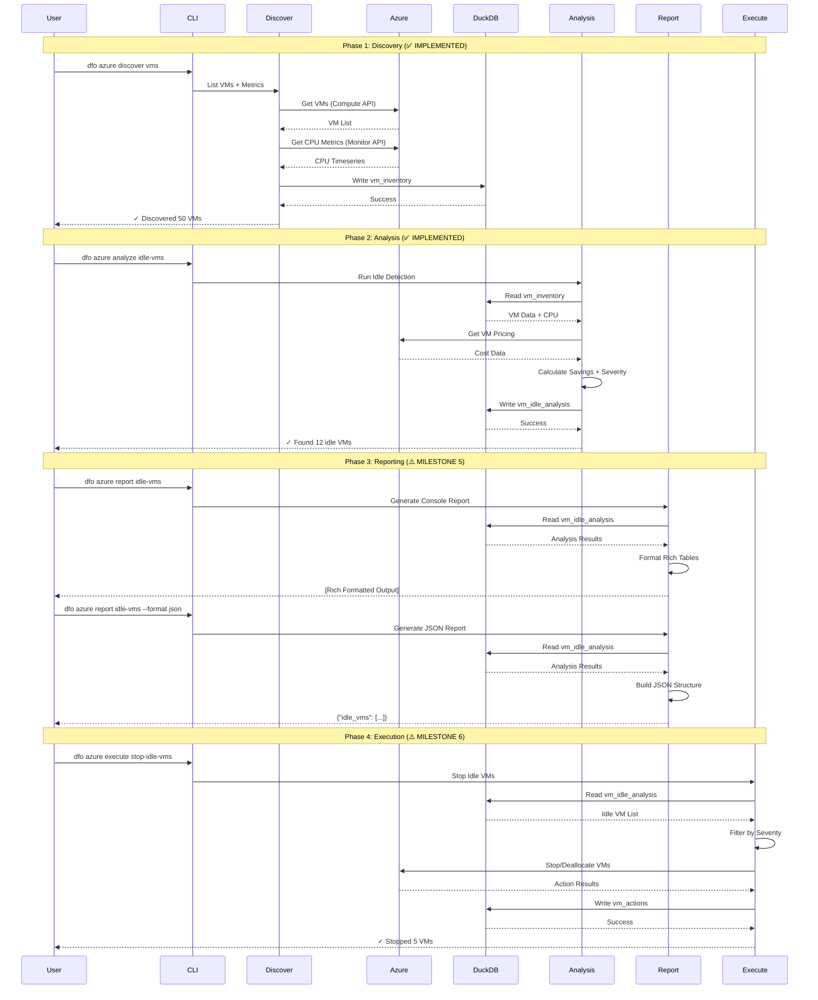
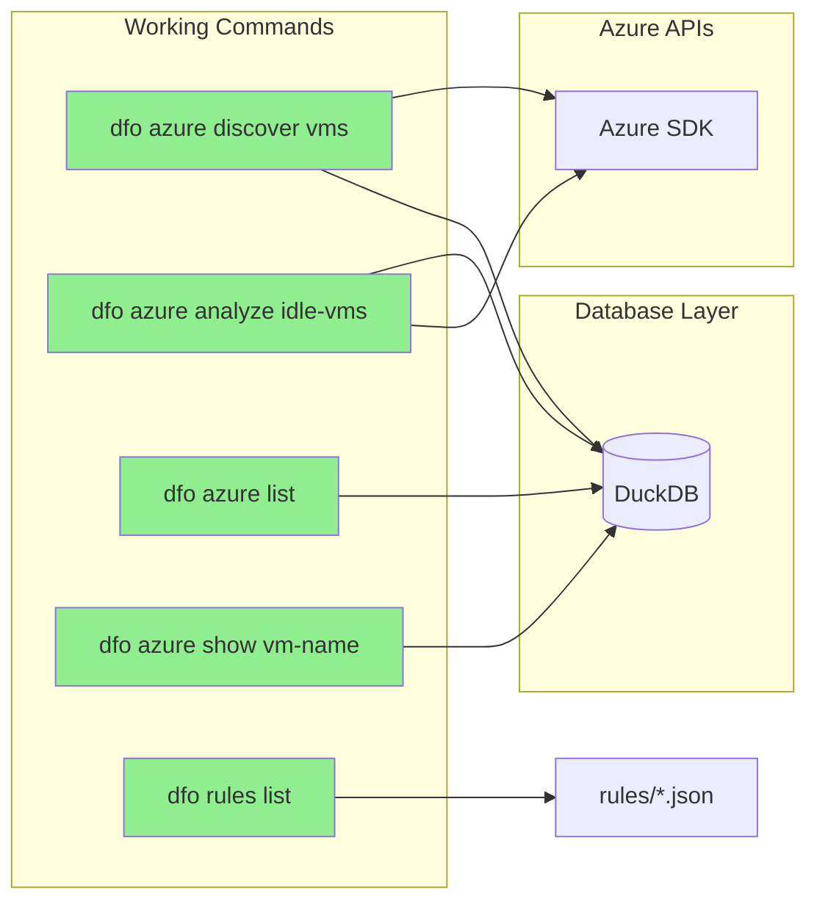
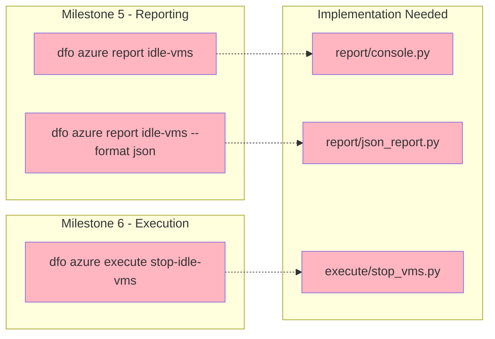
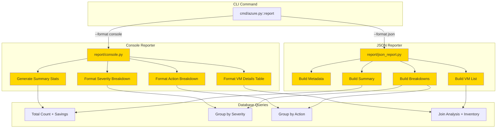
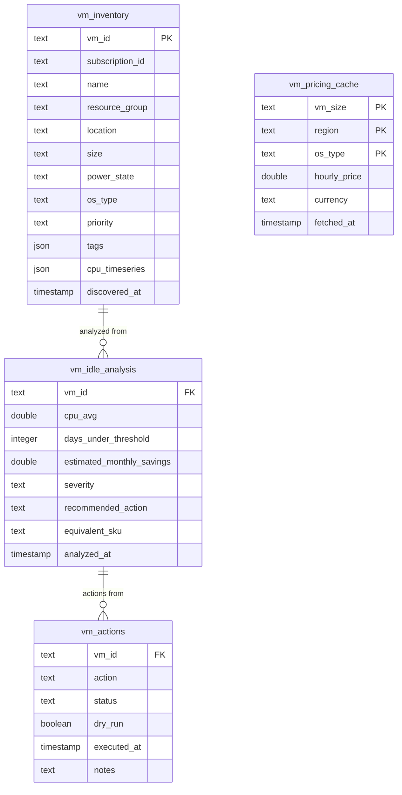

# DFO Architecture Flow

**Last Updated:** 2025-01-24
**Current Status:** Milestone 5 (Reporting Layer) - Planning Phase

---

## Current System Architecture

```mermaid
graph TB
    subgraph "CLI Layer"
        CLI[dfo CLI Entry Point<br/>cli.py]
        CMD_AZURE[Azure Commands<br/>cmd/azure.py]
        CMD_RULES[Rules Commands<br/>cmd/rules.py]
        CMD_DB[DB Commands<br/>cmd/db.py]
    end

    subgraph "Core Layer"
        CONFIG[Configuration<br/>core/config.py<br/>Pydantic Settings]
        AUTH[Authentication<br/>core/auth.py<br/>Azure Credentials]
        MODELS[Data Models<br/>core/models.py<br/>Pydantic Models]
    end

    subgraph "Rules Engine"
        RULES[Rule Engine<br/>rules/__init__.py]
        VM_RULES[VM Rules<br/>vm_rules.json<br/>29 rules]
        STORAGE_RULES[Storage Rules<br/>storage_rules.json<br/>15 rules]
    end

    subgraph "Provider Layer - Azure SDK Integration"
        PROVIDER_CLIENT[Client Factory<br/>providers/azure/client.py]
        PROVIDER_COMPUTE[Compute Client<br/>providers/azure/compute.py]
        PROVIDER_MONITOR[Monitor Client<br/>providers/azure/monitor.py]
        PROVIDER_PRICING[Pricing API<br/>providers/azure/pricing.py]
    end

    subgraph "Discovery Layer - ✅ IMPLEMENTED"
        DISCOVER_VMS[VM Discovery<br/>discover/vms.py<br/>List VMs + CPU Metrics]
    end

    subgraph "Analysis Layer - ✅ IMPLEMENTED"
        ANALYZE_IDLE[Idle VM Analysis<br/>analyze/idle_vms.py<br/>CPU + Cost + Severity]
        ANALYZE_MAPPER[SKU Mapper<br/>analyze/compute_mapper.py<br/>Legacy → Modern SKUs]
    end

    subgraph "Report Layer - ⚠️ STUB (Milestone 5)"
        REPORT_CONSOLE[Console Reporter<br/>report/console.py<br/>❌ TODO]
        REPORT_JSON[JSON Reporter<br/>report/json_report.py<br/>❌ TODO]
    end

    subgraph "Execute Layer - ⚠️ STUB (Milestone 6)"
        EXECUTE_STOP[VM Stop/Deallocate<br/>execute/stop_vms.py<br/>❌ TODO]
    end

    subgraph "Database Layer - DuckDB"
        DB_MANAGER[DuckDB Manager<br/>db/duck.py]
        DB_SCHEMA[Schema Definition<br/>db/schema.sql]

        subgraph "Tables"
            TABLE_INVENTORY[(vm_inventory<br/>VM metadata + CPU data)]
            TABLE_ANALYSIS[(vm_idle_analysis<br/>Analysis results)]
            TABLE_ACTIONS[(vm_actions<br/>Execution logs)]
            TABLE_PRICING[(vm_pricing_cache<br/>Cost data)]
        end
    end

    %% CLI to Commands
    CLI --> CMD_AZURE
    CLI --> CMD_RULES
    CLI --> CMD_DB

    %% Commands use Core
    CMD_AZURE --> CONFIG
    CMD_AZURE --> AUTH
    CMD_AZURE --> MODELS
    CMD_RULES --> RULES

    %% Rules Engine
    RULES --> VM_RULES
    RULES --> STORAGE_RULES

    %% Provider Layer
    AUTH --> PROVIDER_CLIENT
    PROVIDER_CLIENT --> PROVIDER_COMPUTE
    PROVIDER_CLIENT --> PROVIDER_MONITOR
    CONFIG --> PROVIDER_PRICING

    %% Database Layer
    DB_MANAGER --> DB_SCHEMA
    DB_MANAGER --> TABLE_INVENTORY
    DB_MANAGER --> TABLE_ANALYSIS
    DB_MANAGER --> TABLE_ACTIONS
    DB_MANAGER --> TABLE_PRICING

    %% Discovery Flow
    CMD_AZURE -->|discover vms| DISCOVER_VMS
    DISCOVER_VMS --> PROVIDER_COMPUTE
    DISCOVER_VMS --> PROVIDER_MONITOR
    DISCOVER_VMS --> TABLE_INVENTORY

    %% Analysis Flow
    CMD_AZURE -->|analyze idle-vms| ANALYZE_IDLE
    ANALYZE_IDLE --> TABLE_INVENTORY
    ANALYZE_IDLE --> PROVIDER_PRICING
    ANALYZE_IDLE --> ANALYZE_MAPPER
    ANALYZE_IDLE --> TABLE_ANALYSIS

    %% Report Flow (TO BE IMPLEMENTED)
    CMD_AZURE -.->|report idle-vms| REPORT_CONSOLE
    CMD_AZURE -.->|report --format json| REPORT_JSON
    REPORT_CONSOLE -.-> TABLE_ANALYSIS
    REPORT_JSON -.-> TABLE_ANALYSIS

    %% Execute Flow (TO BE IMPLEMENTED)
    CMD_AZURE -.->|execute stop-idle-vms| EXECUTE_STOP
    EXECUTE_STOP -.-> TABLE_ANALYSIS
    EXECUTE_STOP -.-> PROVIDER_COMPUTE
    EXECUTE_STOP -.-> TABLE_ACTIONS

    classDef implemented fill:#90EE90,stroke:#2E7D32,stroke-width:2px
    classDef stub fill:#FFB6C1,stroke:#C62828,stroke-width:2px
    classDef infrastructure fill:#87CEEB,stroke:#1565C0,stroke-width:2px

    class DISCOVER_VMS,ANALYZE_IDLE,ANALYZE_MAPPER implemented
    class REPORT_CONSOLE,REPORT_JSON,EXECUTE_STOP stub
    class DB_MANAGER,TABLE_INVENTORY,TABLE_ANALYSIS,TABLE_ACTIONS,TABLE_PRICING infrastructure
```



---

## Data Flow: End-to-End Pipeline



---

## Current Command Flow

### ✅ Implemented Commands



### ⚠️ Stub Commands (To Implement)



---

## Milestone 5 Scope: Reporting Layer

### Input
- Database: `vm_idle_analysis` table (populated by analyze command)
- Database: `vm_inventory` table (for VM details)

### Output
- **Console Format:** Rich formatted tables with color-coded severity
- **JSON Format:** Structured JSON for integration/automation

### Components to Implement



---

## Database Schema (Current)



---

## Key Design Principles

### 1. Separation of Concerns
- **CLI Layer:** Orchestration only, no business logic
- **Provider Layer:** Azure SDK integration only
- **Analysis Layer:** Pure FinOps logic, no cloud calls
- **Database Layer:** Single source of truth

### 2. Data Flow Direction
```
Azure APIs → Discovery → DuckDB → Analysis → DuckDB → Report → Output
```

### 3. Layer Dependencies
```
cli → cmd → {discover, analyze, report, execute}
                    ↓         ↓         ↓         ↓
                providers  rules    db      models
                    ↓
                  core
```

### 4. No Circular Dependencies
- Discovery never calls Analysis
- Analysis never calls Execute
- Report never modifies data
- DuckDB is the contract between stages

---

## Next Steps for Milestone 5

### Implementation Order

1. **Database Query Functions**
   - Summary statistics query
   - Severity breakdown query
   - Action breakdown query
   - VM details join query

2. **Console Reporter**
   - Summary metrics display
   - Severity breakdown table
   - Action breakdown table
   - VM details table (with limit support)

3. **JSON Reporter**
   - Metadata section
   - Summary section
   - Breakdown sections
   - VM details array

4. **CLI Integration**
   - Update `cmd/azure.py::report` command
   - Add format validation
   - Add output file support
   - Add limit option (console only)

5. **Testing**
   - Unit tests for reporters
   - Integration tests for CLI
   - Empty database handling
   - Edge cases

---

## Success Criteria

### Functional
- [ ] Console report displays all analysis data
- [ ] JSON report outputs valid, structured JSON
- [ ] Reports work with empty database
- [ ] Reports work with populated database
- [ ] File output works for JSON format

### Non-Functional
- [ ] All 275+ tests passing
- [ ] Console output uses Rich formatting
- [ ] JSON output is properly structured
- [ ] No regression in existing commands
- [ ] Documentation updated

---

**Status:** Ready for implementation planning
**Next:** Define detailed implementation tasks
