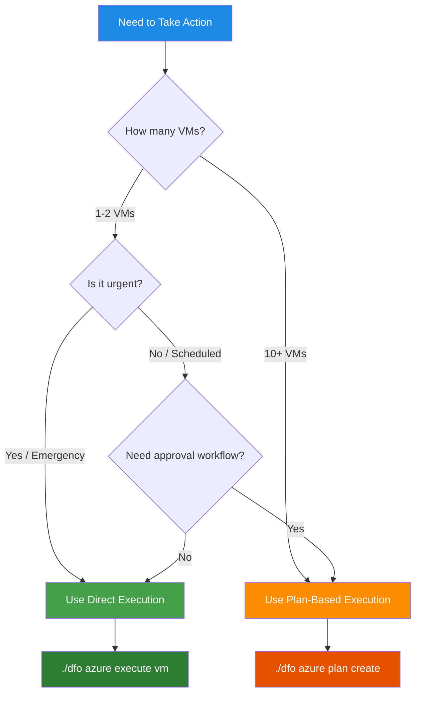
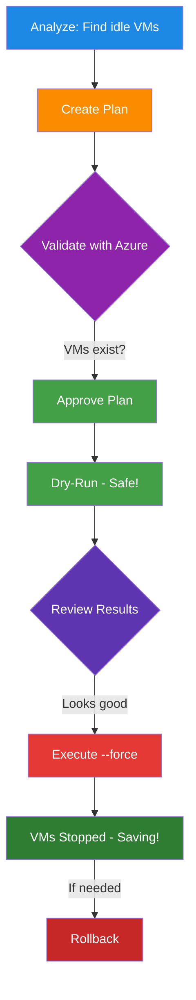
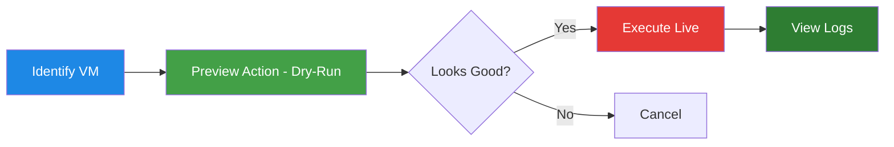
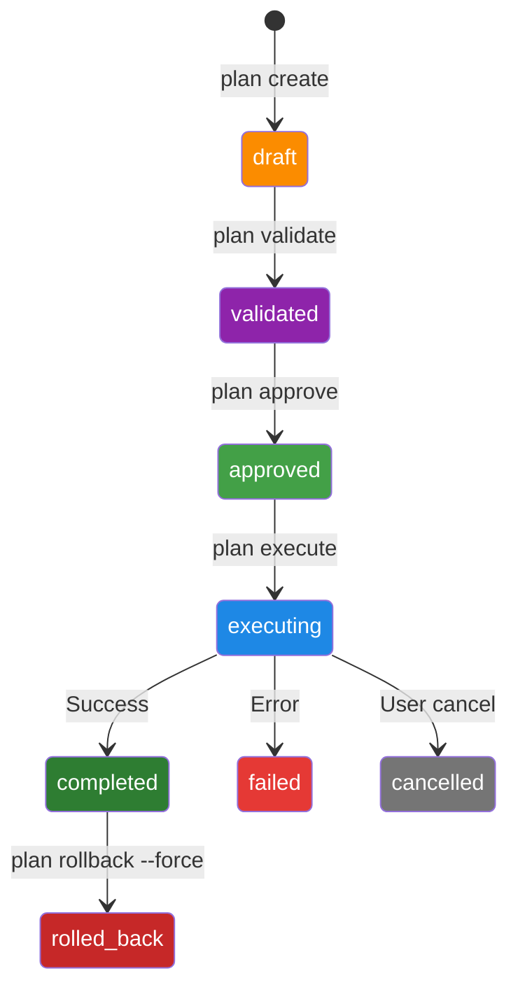

# Execution Workflow Guide

> **A User-Friendly Guide to Safely Executing Cost Optimization Actions**
>
> This guide explains how to safely execute cost-saving actions in your Azure environment using dfo's execution systems: plan-based and direct execution.

**Version:** v0.3.0
**Last Updated:** 2025-11-27

---

## Table of Contents

1. [Choosing the Right Execution Workflow](#choosing-the-right-execution-workflow)
2. [Why Plan-Based Execution?](#why-plan-based-execution)
3. [The Execution Workflow](#the-execution-workflow)
4. [Quick Start Example](#quick-start-example)
5. [Step-by-Step Walkthrough](#step-by-step-walkthrough)
6. [Direct Execution Quick Actions](#direct-execution-quick-actions)
7. [State Diagram](#state-diagram)
8. [Common Commands Reference](#common-commands-reference)
9. [Analysis Types](#analysis-types)
10. [Safety Features](#safety-features)
11. [Security & Access Control](#security--access-control)
12. [Filtering Plans](#filtering-plans)
13. [Troubleshooting](#troubleshooting)
14. [Best Practices](#best-practices)
15. [Example Workflows](#example-workflows)
16. [Quick Reference Card](#quick-reference-card)

---

## Choosing the Right Execution Workflow

dfo offers **two complementary execution workflows** optimized for different scenarios:

### 🚀 Direct Execution - Quick Actions

**Use when:**
- ✅ Need to act on 1-2 VMs immediately
- ✅ Emergency cost reduction (high-cost VM running unintended)
- ✅ Ad-hoc operations (restart a specific VM)
- ✅ Testing/development environments

**Commands:**
```bash
./dfo azure execute vm <vm-name> <action> -g <resource-group>
./dfo azure logs list  # View action history
```

**Characteristics:**
- ⚡ **Fast**: No approval workflow, immediate execution
- 🎯 **Targeted**: Acts on single VMs you specify
- 🔒 **Safe**: Dry-run by default, confirmation prompts
- 📝 **Logged**: Full audit trail captured

---

### 📋 Plan-Based Execution - Batch Operations

**Use when:**
- ✅ Optimizing 10+ VMs at once
- ✅ Scheduled maintenance windows
- ✅ Change management approval required
- ✅ Batch operations from analysis results

**Commands:**
```bash
./dfo azure plan create --from-analysis idle-vms
./dfo azure plan execute <plan-id> --force
```

**Characteristics:**
- 🛡️ **Structured**: Validation → Approval → Execution workflow
- 📦 **Batch**: Multiple VMs in one coordinated operation
- ✅ **Validated**: Azure SDK checks before execution
- 👥 **Collaborative**: Supports approval attribution

---

### Comparison Table

| Factor | Direct Execution | Plan-Based |
|--------|------------------|------------|
| **Speed** | Immediate (1 command) | Multi-step (create → validate → approve → execute) |
| **Scope** | Single VM | Multiple VMs (bulk operations) |
| **Approval** | Confirmation prompt only | Formal approval workflow |
| **Use Case** | Emergency / ad-hoc | Scheduled / change management |
| **Best For** | 1-2 VMs | 10+ VMs |
| **Workflow** | `execute` → confirm → done | `create` → `validate` → `approve` → `execute` |
| **Audit Trail** | Action logs | Plan + action logs |
| **Rollback** | Manual (use opposite action) | Built-in rollback command |

---

### Decision Tree



---

## Why Plan-Based Execution?

**Safety First!** 🛡️

dfo uses a multi-step approval process to ensure you never accidentally make unwanted changes to your Azure resources:

1. **Create** a plan from your analysis
2. **Validate** the plan against Azure (are VMs still there? correct state?)
3. **Review** and approve the plan
4. **Dry-run** to see what would happen (no actual changes)
5. **Execute** for real (only if you're confident)
6. **Rollback** if needed (restart stopped VMs)

This prevents accidents like:
- ❌ Stopping production VMs
- ❌ Acting on stale data
- ❌ Making changes you didn't intend

---

## The Execution Workflow

### Visual Overview



---

## Quick Start Example

Let's walk through a complete example:

### Prerequisites

You've already:
1. ✅ Discovered VMs: `./dfo azure discover vms`
2. ✅ Run analysis: `./dfo azure analyze idle-vms`
3. ✅ Found 5 idle VMs wasting $500/month

Now let's safely stop them:

---

## Step-by-Step Walkthrough

### Step 1: Create a Plan

**Command:**
```bash
./dfo azure plan create --from-analysis idle-vms
```

**What happens:**
- dfo reads the idle VM analysis from the database
- Creates a plan with actions (one per VM)
- Plan starts in "draft" status

**Example Output:**
```
Creating execution plan from analysis: idle-vms

✓ Found 5 VMs in idle-vms analysis
✓ Created plan with 5 actions

Plan Details:
  Plan ID:              plan-20250126-143022
  Plan Name:            idle-vms-2025-01-26
  Status:               draft
  Total Actions:        5
  Estimated Savings:    $500/month

Actions:
  1. Stop VM: prod-web-01 (saves $100/month)
  2. Stop VM: dev-db-01 (saves $120/month)
  3. Stop VM: test-api-01 (saves $80/month)
  4. Stop VM: staging-app-01 (saves $150/month)
  5. Stop VM: dev-cache-01 (saves $50/month)

Next step: Validate plan with Azure
  ./dfo azure plan validate plan-20250126-143022
```

**What you should do:**
- ✅ Review the VMs listed - do these look right?
- ✅ Save the plan ID: `plan-20250126-143022`

---

### Step 2: Validate the Plan

**Why validate?**
- VM might have been deleted since analysis
- VM might already be stopped
- VM might have changed size
- Someone else might be working on it

**Command:**
```bash
./dfo azure plan validate plan-20250126-143022
```

**What happens:**
- dfo checks each VM in Azure
- Verifies VM exists
- Verifies VM is in expected state (running)
- Verifies you have permissions

**Example Output (All Good):**
```
Validating plan: plan-20250126-143022

Checking 5 actions against Azure...

✓ prod-web-01: VM exists, currently running
✓ dev-db-01: VM exists, currently running
✓ test-api-01: VM exists, currently running
✓ staging-app-01: VM exists, currently running
✓ dev-cache-01: VM exists, currently running

Validation Summary:
  Total Actions:    5
  Valid:           5
  Warnings:        0
  Errors:          0

✓ Plan is valid and ready for approval

Next step: Approve plan
  ./dfo azure plan approve plan-20250126-143022
```

**Example Output (With Issues):**
```
Validating plan: plan-20250126-143022

Checking 5 actions against Azure...

✓ prod-web-01: VM exists, currently running
✓ dev-db-01: VM exists, currently running
⚠ test-api-01: VM already stopped
✗ staging-app-01: VM not found (may have been deleted)
✓ dev-cache-01: VM exists, currently running

Validation Summary:
  Total Actions:    5
  Valid:           3
  Warnings:        1 (will be skipped)
  Errors:          1 (will fail)

⚠ Plan has issues - review before proceeding

Actions:
  - test-api-01 will be skipped (already in desired state)
  - staging-app-01 will fail (VM not found)

Recommendation: Fix issues or proceed with partial execution

Next step: Approve plan (warnings/errors will be handled)
  ./dfo azure plan approve plan-20250126-143022
```

**What you should do:**
- ✅ Review validation results
- ✅ If errors: investigate and decide whether to proceed
- ✅ Warnings are usually OK (VMs already in desired state)

---

### Step 3: Approve the Plan

**Why approve?**
This is your checkpoint: "I've reviewed the plan and I want to proceed"

**Command:**
```bash
./dfo azure plan approve plan-20250126-143022
```

**What happens:**
- Plan status changes from "validated" to "approved"
- Adds approval timestamp
- Records who approved it

**Example Output:**
```
Approving plan: plan-20250126-143022

✓ Plan approved

Plan Status:
  Status:          approved
  Approved At:     2025-01-26 14:35:00
  Approved By:     user@company.com
  Total Actions:   5
  Ready for:       Execution

Next steps:
  1. Dry-run first (SAFE - no changes):
     ./dfo azure plan execute plan-20250126-143022

  2. Then execute for real (WARNING - makes changes):
     ./dfo azure plan execute plan-20250126-143022 --force
```

---

### Step 4: Dry-Run Execution (SAFE!)

**What is a dry-run?**
- Simulates what would happen
- **No actual changes to Azure**
- Shows you exactly what will happen
- Always run this first!

**Command:**
```bash
./dfo azure plan execute plan-20250126-143022
```

**Note:** Default is dry-run (safe). No `--force` flag = no real changes.

**Example Output:**
```
Executing plan: plan-20250126-143022
Mode: DRY-RUN (no actual changes will be made)

Action 1/5: Stop VM prod-web-01
  Resource Group: production-rg
  Current State:  running
  Action:         stop
  ✓ Would stop VM
  Estimated Savings: $100/month

Action 2/5: Stop VM dev-db-01
  Resource Group: development-rg
  Current State:  running
  Action:         stop
  ✓ Would stop VM
  Estimated Savings: $120/month

Action 3/5: Stop VM test-api-01
  Resource Group: test-rg
  Current State:  stopped
  Action:         stop
  ⊘ Skipped (VM already stopped)

Action 4/5: Stop VM staging-app-01
  Resource Group: staging-rg
  Current State:  <not found>
  Action:         stop
  ✗ Would fail (VM not found)

Action 5/5: Stop VM dev-cache-01
  Resource Group: development-rg
  Current State:  running
  Action:         stop
  ✓ Would stop VM
  Estimated Savings: $50/month

DRY-RUN SUMMARY:
┌─────────────────────────────────────────┐
│         Execution Summary               │
├─────────────────────────────────────────┤
│ Total Actions:        5                 │
│ Would Succeed:        3                 │
│ Would Skip:           1 (already done)  │
│ Would Fail:           1 (VM not found)  │
│ Estimated Savings:    $270/month        │
│                                         │
│ ⚠ 1 action would fail                  │
│ ⊘ 1 action would be skipped            │
└─────────────────────────────────────────┘

This was a DRY-RUN - no actual changes were made.

Next steps:
  1. Review the results above
  2. If happy, execute for real:
     ./dfo azure plan execute plan-20250126-143022 --force
```

**What you should do:**
- ✅ **READ THE OUTPUT CAREFULLY**
- ✅ Verify each action looks correct
- ✅ Check which VMs would succeed/skip/fail
- ✅ Decide if you want to proceed

---

### Step 5: Execute for Real (⚠️ WARNING!)

**⚠️ THIS MAKES ACTUAL CHANGES TO AZURE!**

Only proceed if:
- ✅ You reviewed the dry-run output
- ✅ Everything looks correct
- ✅ You're ready to make real changes

**Command:**
```bash
./dfo azure plan execute plan-20250126-143022 --force
```

**Note the `--force` flag:** This is what makes it real!

**Example Output:**
```
Executing plan: plan-20250126-143022
Mode: LIVE EXECUTION (⚠️ making real changes to Azure)

⚠️ WARNING: This will make actual changes to your Azure resources!
Continue? [y/N]: y

Action 1/5: Stop VM prod-web-01
  ✓ VM stopped successfully
  Realized Savings: $100/month

Action 2/5: Stop VM dev-db-01
  ✓ VM stopped successfully
  Realized Savings: $120/month

Action 3/5: Stop VM test-api-01
  ⊘ Skipped (VM already stopped)

Action 4/5: Stop VM staging-app-01
  ✗ Failed (VM not found)

Action 5/5: Stop VM dev-cache-01
  ✓ VM stopped successfully
  Realized Savings: $50/month

EXECUTION SUMMARY:
┌─────────────────────────────────────────┐
│         Execution Complete              │
├─────────────────────────────────────────┤
│ Total Actions:        5                 │
│ Succeeded:            3 ✓               │
│ Skipped:              1 ⊘               │
│ Failed:               1 ✗               │
│ Realized Savings:     $270/month        │
│                                         │
│ Status:               completed         │
│ Completed At:         2025-01-26 14:45  │
└─────────────────────────────────────────┘

VMs Stopped:
  ✓ prod-web-01 (production-rg)
  ✓ dev-db-01 (development-rg)
  ✓ dev-cache-01 (development-rg)

If you need to undo this:
  ./dfo azure plan rollback plan-20250126-143022 --force
```

**What just happened:**
- ✅ 3 VMs were stopped in Azure
- ✅ You're now saving $270/month
- ✅ Changes are recorded in database
- ✅ You can rollback if needed

---

### Step 6: Rollback (If Needed)

**When to rollback:**
- ❌ Stopped wrong VMs
- ❌ Need to restore service quickly
- ❌ Made a mistake

**What is rollback?**
- Reverses the actions taken
- For stopped VMs: starts them back up
- Works on successfully executed actions only

**Command (Dry-Run First!):**
```bash
./dfo azure plan rollback plan-20250126-143022
```

**Example Output (Dry-Run):**
```
Rolling back plan: plan-20250126-143022
Mode: DRY-RUN (no actual changes will be made)

Rollback Actions:

Action 1/3: Start VM prod-web-01
  Current State:  stopped (stopped by dfo on 2025-01-26 14:45)
  Rollback:       start
  ✓ Would start VM

Action 2/3: Start VM dev-db-01
  Current State:  stopped (stopped by dfo on 2025-01-26 14:45)
  Rollback:       start
  ✓ Would start VM

Action 3/3: Start VM dev-cache-01
  Current State:  stopped (stopped by dfo on 2025-01-26 14:45)
  Rollback:       start
  ✓ Would start VM

DRY-RUN SUMMARY:
  Would rollback: 3 actions
  Would restore:  3 VMs to running state

This was a DRY-RUN - no actual changes were made.

To execute rollback for real:
  ./dfo azure plan rollback plan-20250126-143022 --force
```

**Command (Live Rollback):**
```bash
./dfo azure plan rollback plan-20250126-143022 --force
```

**Example Output (Live):**
```
Rolling back plan: plan-20250126-143022
Mode: LIVE ROLLBACK (⚠️ making real changes to Azure)

⚠️ WARNING: This will restart VMs that were stopped!
Continue? [y/N]: y

Action 1/3: Start VM prod-web-01
  ✓ VM started successfully

Action 2/3: Start VM dev-db-01
  ✓ VM started successfully

Action 3/3: Start VM dev-cache-01
  ✓ VM started successfully

ROLLBACK SUMMARY:
  Total Actions:    3
  Succeeded:        3
  Failed:           0

✓ Rollback complete - all VMs restored

VMs Started:
  ✓ prod-web-01 (production-rg)
  ✓ dev-db-01 (development-rg)
  ✓ dev-cache-01 (development-rg)
```

---

## Direct Execution Quick Actions

For quick, ad-hoc actions on individual VMs, use direct execution instead of the full plan workflow.

### When to Use Direct Execution

✅ **Use direct execution when:**
- Acting on 1-2 VMs only
- Emergency cost reduction needed
- Quick restart/stop required
- Testing or development environments

❌ **Don't use direct execution when:**
- Acting on 10+ VMs (use plans for efficiency)
- Formal approval workflow required
- Need coordinated batch operations
- Scheduled maintenance windows

### Direct Execution Workflow



### Basic Example

```bash
# 1. Preview action (dry-run, safe)
./dfo azure execute vm expensive-vm stop -g production-rg

# Output shows:
#   [DRY RUN] Would execute stop on VM expensive-vm
#   Pre-state: running
#   Expected result: VM will be stopped
#   Monthly savings: $120

# 2. Execute for real (with confirmation)
./dfo azure execute vm expensive-vm stop -g production-rg --no-dry-run

# Prompt appears:
#   [LIVE EXECUTION] This will modify Azure resources
#   Action: stop
#   VM: expensive-vm
#   Resource Group: production-rg
#
#   Are you sure you want to proceed? [y/N]: y

# 3. Execute with auto-confirm (skip prompt)
./dfo azure execute vm expensive-vm stop -g production-rg --no-dry-run --yes \
  --reason "Emergency cost reduction"

# Output:
#   ✓ VM expensive-vm stopped successfully
#   Duration: 15.3 seconds
#   Action ID: act-20251127-143022-abc123
```

### Supported Actions

| Action | Description | Reversible | Notes |
|--------|-------------|------------|-------|
| `stop` | Stop VM (keeps billing for storage) | ✅ Yes (use `restart`) | Fast, preserves everything |
| `deallocate` | Deallocate VM (stops compute billing) | ✅ Yes (use `restart`) | Stops most billing |
| `restart` | Restart stopped/deallocated VM | N/A | Brings VM back online |
| `downsize` | Resize to smaller SKU | ⚠️ Partial (manual upsize) | Requires `--target-sku` |
| `delete` | Permanently delete VM | ❌ No | **DANGEROUS!** Cannot be undone |

### Action Examples

#### Stop a VM
```bash
# Dry-run (preview only)
./dfo azure execute vm my-vm stop -g my-rg

# Live execution
./dfo azure execute vm my-vm stop -g my-rg --no-dry-run --yes
```

#### Deallocate a VM
```bash
./dfo azure execute vm my-vm deallocate -g my-rg \
  --reason "Weekend cost savings"
```

#### Restart a VM
```bash
./dfo azure execute vm my-vm restart -g my-rg --no-dry-run --yes
```

#### Downsize a VM
```bash
# Note: VM must be stopped first
./dfo azure execute vm my-vm stop -g my-rg --no-dry-run --yes
./dfo azure execute vm my-vm downsize -g my-rg \
  --target-sku Standard_B2s \
  --no-dry-run --yes \
  --reason "Rightsizing based on analysis"
```

#### Delete a VM (DANGEROUS!)
```bash
# Preview deletion
./dfo azure execute vm old-test-vm delete -g test-rg

# Delete (cannot be undone!)
./dfo azure execute vm old-test-vm delete -g test-rg \
  --no-dry-run --yes \
  --reason "Decommissioning test environment"
```

### Viewing Action Logs

All direct execution actions are logged for audit trails:

```bash
# List recent actions
./dfo azure logs list

# Filter by VM
./dfo azure logs list --vm-name my-vm

# Filter by action type
./dfo azure logs list --action stop

# Show live executions only
./dfo azure logs list --executed

# Show dry-runs only
./dfo azure logs list --dry-run

# Show actions from last 7 days
./dfo azure logs list --since 7d

# Show detailed action info
./dfo azure logs show act-20251127-143022-abc123
```

### Safety Features

Direct execution includes multiple safety layers:

1. **Dry-Run by Default**
   - All commands default to dry-run (preview only)
   - Must explicitly use `--no-dry-run` for live execution

2. **Confirmation Prompts**
   - Live executions require confirmation
   - Use `--yes` to skip (for automation/scripts)

3. **Feature Flag**
   - Must enable `DFO_ENABLE_DIRECT_EXECUTION=true` in `.env`
   - Disabled by default for security

4. **Protection Tags**
   - VMs tagged with `dfo-protected=true` cannot be modified
   - Prevents accidental actions on critical resources

5. **Validation**
   - Resource validation (VM exists?)
   - Action validation (appropriate for current state?)
   - Azure SDK validation (unless `--no-validation` used)

6. **Comprehensive Logging**
   - Every action logged (dry-run and live)
   - Captures: user, command, pre/post state, timestamps
   - Full audit trail for compliance

### Protection Tags

Protect critical VMs from accidental actions:

```bash
# Add protection tag via Azure CLI
az vm update -g production-rg -n critical-db-vm \
  --set tags.dfo-protected=true

# Now dfo will refuse to act on this VM
./dfo azure execute vm critical-db-vm stop -g production-rg
# Error: Validation Failed
# VM is protected (tag: dfo-protected=true)

# Override with --no-validation (use with extreme caution!)
./dfo azure execute vm critical-db-vm stop -g production-rg \
  --no-validation --no-dry-run --yes
```

---

## State Diagram

Here's how plan status changes through the workflow:



---

## Common Commands Reference

### Plan Management

```bash
# Create plan from analysis
./dfo azure plan create --from-analysis <analysis-type>

# List all plans
./dfo azure plan list

# Show plan details
./dfo azure plan show <plan-id>

# Show plan with actions
./dfo azure plan show <plan-id> --detail
```

### Execution Workflow

```bash
# 1. Validate
./dfo azure plan validate <plan-id>

# 2. Approve
./dfo azure plan approve <plan-id>

# 3. Dry-run (SAFE)
./dfo azure plan execute <plan-id>

# 4. Execute for real (⚠️ WARNING)
./dfo azure plan execute <plan-id> --force

# 5. Rollback if needed
./dfo azure plan rollback <plan-id>              # dry-run
./dfo azure plan rollback <plan-id> --force      # live
```

### Plan Status

```bash
# Check plan status
./dfo azure plan status <plan-id>

# List plans by status
./dfo azure plan list --status approved
./dfo azure plan list --status completed
```

---

## Analysis Types

You can create plans from these analysis types:

| Analysis Type | What it finds | Action taken |
|--------------|---------------|--------------|
| `idle-vms` | VMs with < 5% CPU for 14 days | Stop VM |
| `low-cpu` | VMs with < 20% CPU (rightsizing opportunity) | Recommend smaller SKU |
| `stopped-vms` | VMs stopped for 30+ days | Recommend deletion |

**Example:**
```bash
# Create plan from idle VMs
./dfo azure plan create --from-analysis idle-vms

# Create plan from low-CPU analysis
./dfo azure plan create --from-analysis low-cpu

# Create plan from stopped VMs
./dfo azure plan create --from-analysis stopped-vms
```

---

## Safety Features

### 1. Dry-Run by Default
- Default execution is **always dry-run** (no changes)
- Must use `--force` to make real changes
- Prevents accidents

### 2. Validation Before Execution
- Checks VMs still exist
- Checks VMs are in expected state
- Warns about issues before execution

### 3. Confirmation Prompts
- Asks "Are you sure?" before live execution
- Shows what will change
- Can skip with `--yes` flag (use carefully!)

### 4. Audit Trail
- Every action is logged
- Timestamps recorded
- Can review history later

### 5. Rollback Support
- Can undo stop actions
- Restores VMs to running state
- Also dry-run first

---

## Security & Access Control

dfo respects Azure's security model and adds additional safety layers for cost optimization operations.

### Azure RBAC Integration

dfo uses Azure Role-Based Access Control (RBAC) - your Azure permissions determine what actions you can perform.

**Required Azure Permissions:**

| Operation | Required Azure Role | Scope |
|-----------|-------------------|-------|
| **Discovery** | `Reader` | Subscription or Resource Group |
| **Analysis** | `Reader` | Subscription or Resource Group |
| **Reporting** | `Reader` | Subscription or Resource Group |
| **Stop/Deallocate VMs** | `Virtual Machine Contributor` | Resource Group or specific VMs |
| **Resize VMs** | `Virtual Machine Contributor` | Resource Group or specific VMs |
| **Delete VMs** | `Contributor` | Resource Group or specific VMs |

**Best Practice**: Use service principals with least-privilege access, not personal accounts.

```bash
# Example: Create service principal with VM Contributor role
az ad sp create-for-rbac \
  --name "dfo-cost-optimization" \
  --role "Virtual Machine Contributor" \
  --scopes /subscriptions/{subscription-id}/resourceGroups/production-rg
```

### Authentication Methods

dfo supports multiple authentication methods (via Azure DefaultAzureCredential):

1. **Service Principal** (Recommended for production)
   ```bash
   # Set in .env
   AZURE_TENANT_ID=your-tenant-id
   AZURE_CLIENT_ID=your-client-id
   AZURE_CLIENT_SECRET=your-client-secret
   AZURE_SUBSCRIPTION_ID=your-subscription-id
   ```

2. **Azure CLI** (Good for development)
   ```bash
   az login
   ./dfo azure discover  # Uses CLI credentials
   ```

3. **Managed Identity** (For VMs/containers running in Azure)
   - Automatically detected when running on Azure resources
   - No credentials needed in .env

### Feature Flag Security

Direct execution is disabled by default for security. Must explicitly enable:

```bash
# In .env file
DFO_ENABLE_DIRECT_EXECUTION=false   # Default (safe)
DFO_ENABLE_DIRECT_EXECUTION=true    # Enable direct execution
```

**Recommendations by Environment:**

| Environment | Setting | Rationale |
|-------------|---------|-----------|
| **Production** | `false` or restricted | Use plan-based workflow for change management |
| **Staging** | `true` (limited users) | Allow quick fixes, but log everything |
| **Development** | `true` | Enable for developer productivity |

### Protection Tags

Protect critical VMs from optimization actions:

```bash
# Protect a VM
az vm update -g prod-rg -n critical-database-vm \
  --set tags.dfo-protected=true

# Protect multiple VMs
az vm list -g prod-rg --query "[?starts_with(name, 'critical-')].name" -o tsv | \
  xargs -I {} az vm update -g prod-rg -n {} --set tags.dfo-protected=true
```

**Protection behavior:**
- ✅ Discovery and analysis: **Always allowed**
- ✅ Reports: **Shows findings** (VM appears in reports)
- ❌ Execution (plan-based): **Blocked** (action skipped with warning)
- ❌ Execution (direct): **Blocked** (validation fails)

**Override protection** (use with extreme caution):
```bash
# Direct execution only
./dfo azure execute vm critical-vm stop -g prod-rg \
  --no-validation --no-dry-run --yes
```

### Audit Trail

All execution actions (plan-based and direct) are logged for compliance:

**Logged Information:**
- Action ID (unique identifier)
- Timestamp (execution time)
- User (Azure identity or local user)
- Service Principal (if using SP auth)
- Command (full command line)
- VM details (name, resource group, ID)
- Action type (stop, deallocate, delete, etc.)
- Status (pending, executing, completed, failed)
- Execution type (live vs dry-run)
- Pre-state (VM state before action)
- Post-state (VM state after action)
- Result message (success/failure details)
- Reason (if provided via `--reason`)
- Metadata (environment, subscription, etc.)

**Query audit logs:**
```bash
# All live executions in last 30 days
./dfo azure logs list --executed --since 30d

# Actions by specific user
./dfo azure logs list --user john.doe@company.com

# Failed actions
./dfo azure logs list --status failed

# Export for compliance
./dfo azure logs list --format json --since 90d > audit-trail-q4-2025.json
```

### Per-Environment Configuration

Configure dfo differently for each environment:

**Production Environment:**
```bash
# .env.production
DFO_ENABLE_DIRECT_EXECUTION=false
DFO_DRY_RUN_DEFAULT=true
AZURE_CLIENT_ID=prod-sp-id-read-only
```

**Staging Environment:**
```bash
# .env.staging
DFO_ENABLE_DIRECT_EXECUTION=true
DFO_DRY_RUN_DEFAULT=true
AZURE_CLIENT_ID=staging-sp-id-contributor
```

**Development Environment:**
```bash
# .env.development
DFO_ENABLE_DIRECT_EXECUTION=true
DFO_DRY_RUN_DEFAULT=false  # Allow quick actions
AZURE_CLIENT_ID=dev-sp-id-contributor
```

### Compliance Considerations

For regulated environments:

1. **Separation of Duties**
   - Use different service principals for discovery vs execution
   - Require approval workflow for production (use plan-based)

2. **Audit Retention**
   - Export logs regularly: `./dfo azure logs list --format json > monthly-audit.json`
   - Store exported logs in tamper-proof storage (Azure Storage with immutability)

3. **Change Management**
   - Use plan-based execution for production workloads
   - Require `--approved-by` attribution: `./dfo azure plan approve <plan-id> --approved-by "manager@company.com"`
   - Document all live executions with `--reason` flag

4. **Access Reviews**
   - Regularly review Azure RBAC assignments
   - Rotate service principal credentials quarterly
   - Audit who has `DFO_ENABLE_DIRECT_EXECUTION=true` access

### Security Best Practices

✅ **Do:**
- Use service principals with least-privilege RBAC
- Enable `dfo-protected` tags on critical VMs
- Always provide `--reason` for live executions
- Export audit logs monthly for compliance
- Use plan-based workflow for production changes
- Test with dry-run first
- Review validation warnings before proceeding

❌ **Don't:**
- Share service principal credentials
- Use `--no-validation` in production
- Skip confirmation prompts (`--yes`) without good reason
- Enable direct execution globally in production
- Ignore protection tags
- Execute without documented reason

---

## Filtering Plans

You can filter which VMs to include in a plan:

### By Severity

```bash
# Only critical findings
./dfo azure plan create --from-analysis idle-vms --severity critical

# Critical and high
./dfo azure plan create --from-analysis idle-vms --severity critical,high
```

### By Resource Group

```bash
# Only specific resource group
./dfo azure plan create --from-analysis idle-vms --resource-group development-rg

# Multiple resource groups
./dfo azure plan create --from-analysis idle-vms --resource-group dev-rg,test-rg
```

### By Tag

```bash
# Only VMs with specific tag
./dfo azure plan create --from-analysis idle-vms --tag Environment=dev

# Multiple tags
./dfo azure plan create --from-analysis idle-vms --tag Environment=dev,Owner=team-a
```

---

## Troubleshooting

### "Plan not found"

**Problem:** `Plan ID not found: plan-12345`

**Solution:**
```bash
# List all plans to find the correct ID
./dfo azure plan list
```

### "Plan validation failed"

**Problem:** Some VMs no longer exist or are in wrong state

**Solutions:**
1. Review validation output carefully
2. Decide if you want to proceed with partial execution
3. Or re-run analysis to get fresh data:
   ```bash
   ./dfo azure analyze idle-vms
   ./dfo azure plan create --from-analysis idle-vms
   ```

### "Cannot execute - plan not approved"

**Problem:** Trying to execute a plan that hasn't been approved

**Solution:**
```bash
# Approve the plan first
./dfo azure plan approve <plan-id>

# Then execute
./dfo azure plan execute <plan-id> --force
```

### "Execution failed on some actions"

**Problem:** Some actions succeeded, some failed

**What happened:**
- dfo executes actions one by one
- If one fails, it continues with the rest
- Failed actions are marked as failed
- Successful actions are recorded

**What to do:**
1. Check the execution summary
2. Review failed actions
3. Fix issues with failed VMs
4. Optionally create a new plan for failed VMs

### "Can I rollback a partially executed plan?"

**Yes!** Rollback only affects successfully executed actions.

```bash
# See what would be rolled back
./dfo azure plan rollback <plan-id>

# Rollback what succeeded
./dfo azure plan rollback <plan-id> --force
```

---

## Best Practices

### ✅ DO

1. **Always dry-run first**
   ```bash
   ./dfo azure plan execute <plan-id>  # Review output
   ./dfo azure plan execute <plan-id> --force  # Then execute
   ```

2. **Validate before executing**
   ```bash
   ./dfo azure plan validate <plan-id>  # Check for issues
   ```

3. **Review plan details**
   ```bash
   ./dfo azure plan show <plan-id> --detail  # See all actions
   ```

4. **Start with low-risk environments**
   - Test in dev/test first
   - Then staging
   - Finally production

5. **Filter conservatively**
   - Start with `--severity critical` only
   - Expand to `high` after confidence builds

6. **Keep plans focused**
   - One resource group at a time
   - One environment at a time
   - Easier to validate and rollback

### ❌ DON'T

1. **Don't skip validation**
   - Always validate before approving

2. **Don't skip dry-run**
   - Always dry-run before `--force`

3. **Don't execute stale plans**
   - If analysis is >1 week old, re-run it
   - VMs may have changed

4. **Don't mix environments in one plan**
   - Keep production separate from dev/test
   - Easier to manage and validate

5. **Don't ignore warnings**
   - Review validation warnings carefully
   - Understand why they occurred

---

## Example Workflows

### Workflow 1: Stop Idle Dev/Test VMs

```bash
# 1. Run analysis
./dfo azure analyze idle-vms

# 2. Create plan for dev environment only
./dfo azure plan create \
  --from-analysis idle-vms \
  --resource-group development-rg \
  --severity critical,high

# 3. Validate
./dfo azure plan validate plan-20250126-143022

# 4. Approve
./dfo azure plan approve plan-20250126-143022

# 5. Dry-run
./dfo azure plan execute plan-20250126-143022

# 6. Review output, then execute for real
./dfo azure plan execute plan-20250126-143022 --force

# Done! VMs stopped, saving money
```

### Workflow 2: Conservative Production Approach

```bash
# 1. Run analysis
./dfo azure analyze idle-vms

# 2. Create plan for CRITICAL only in production
./dfo azure plan create \
  --from-analysis idle-vms \
  --resource-group production-rg \
  --severity critical

# 3. Review findings manually
./dfo azure plan show plan-20250126-150000 --detail

# 4. Validate
./dfo azure plan validate plan-20250126-150000

# 5. Approve
./dfo azure plan approve plan-20250126-150000

# 6. Dry-run
./dfo azure plan execute plan-20250126-150000

# 7. If happy with dry-run, execute
./dfo azure plan execute plan-20250126-150000 --force

# 8. Monitor the VMs
# (wait 24 hours to ensure services not affected)

# 9. If issues, rollback
./dfo azure plan rollback plan-20250126-150000 --force
```

### Workflow 3: Phased Rollout

```bash
# Phase 1: Development (day 1)
./dfo azure plan create --from-analysis idle-vms --resource-group dev-rg
# ... validate, approve, execute

# Phase 2: Test (day 2)
./dfo azure plan create --from-analysis idle-vms --resource-group test-rg
# ... validate, approve, execute

# Phase 3: Staging (day 3)
./dfo azure plan create --from-analysis idle-vms --resource-group staging-rg
# ... validate, approve, execute

# Phase 4: Production - Critical only (day 4)
./dfo azure plan create --from-analysis idle-vms \
  --resource-group prod-rg --severity critical
# ... validate, approve, execute

# Phase 5: Production - High severity (day 7, after monitoring)
./dfo azure plan create --from-analysis idle-vms \
  --resource-group prod-rg --severity high
# ... validate, approve, execute
```

---

## Quick Reference Card

```
┌─────────────────────────────────────────────────────────────────┐
│                    EXECUTION QUICK REFERENCE                    │
├─────────────────────────────────────────────────────────────────┤
│ CREATE      ./dfo azure plan create --from-analysis idle-vms   │
│ VALIDATE    ./dfo azure plan validate <plan-id>                │
│ APPROVE     ./dfo azure plan approve <plan-id>                 │
│ DRY-RUN     ./dfo azure plan execute <plan-id>                 │
│ EXECUTE     ./dfo azure plan execute <plan-id> --force         │
│ ROLLBACK    ./dfo azure plan rollback <plan-id> --force        │
├─────────────────────────────────────────────────────────────────┤
│ SHOW PLAN   ./dfo azure plan show <plan-id> --detail           │
│ LIST PLANS  ./dfo azure plan list                              │
│ STATUS      ./dfo azure plan status <plan-id>                  │
└─────────────────────────────────────────────────────────────────┘

Remember:
  🛡️  Default is dry-run (safe)
  ⚠️  --force makes real changes
  ✅  Always validate first
  👀  Always dry-run before --force
```

---

## Need Help?

- **Quickstart:** [QUICKSTART.md](../QUICKSTART.md)
- **Troubleshooting:** [TROUBLESHOOTING.md](TROUBLESHOOTING.md)
- **Architecture:** [ARCHITECTURE.md](ARCHITECTURE.md) - Execution system details
- **Plan Status:** [PLAN_STATUS.md](PLAN_STATUS.md) - State machine reference

---

**Last Updated:** 2025-01-26
**Version:** v0.2.0
