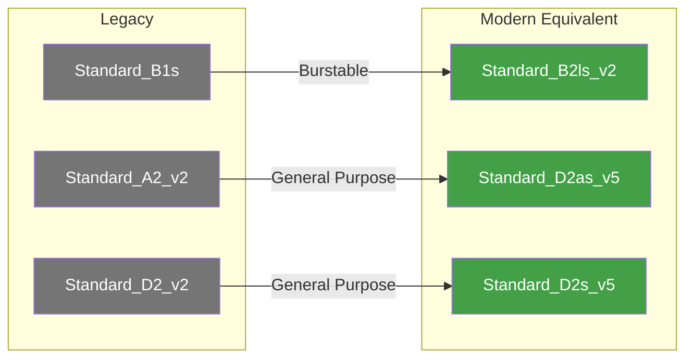
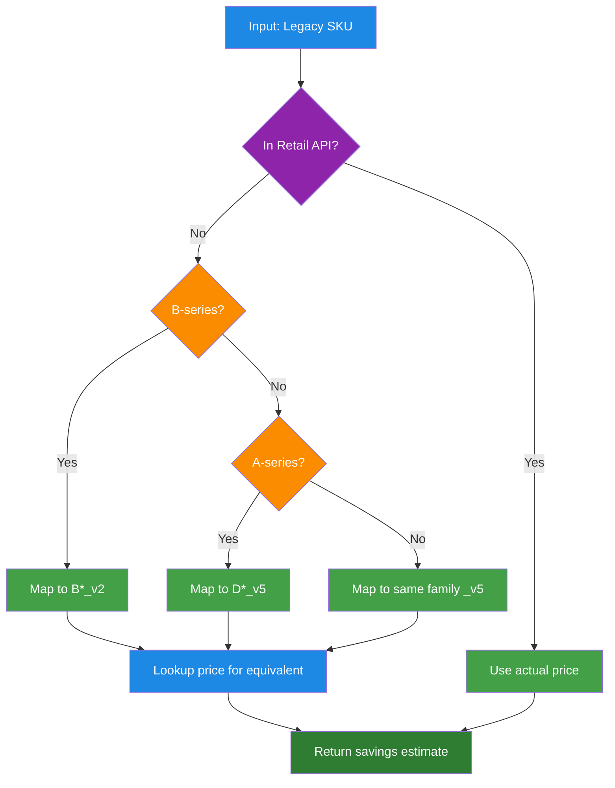
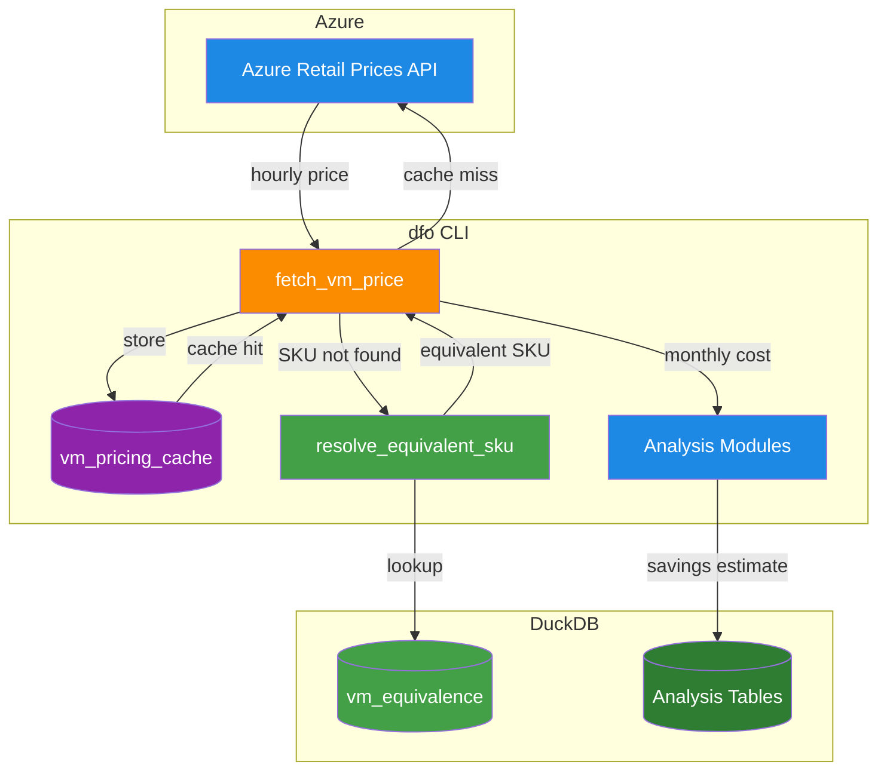
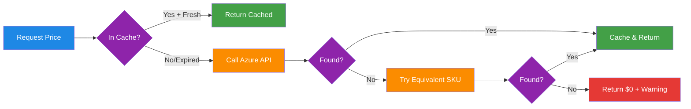

# Azure VM Selection Strategy
A practical guide for mapping legacy Azure VM SKUs to modern equivalents, especially when legacy SKUs do not appear in the Azure Retail Prices API. This strategy is designed for cost analysis, right-sizing, automated optimization pipelines, and FinOps tooling (e.g., dfo).

---

## 1. Overview
Azure periodically retires older VM families or removes them from the public Retail Prices API. When analyzing workloads—especially for optimization—you may encounter VMs such as **Standard_B1s**, **Standard_A2_v2**, or **D2_v2** that no longer have retail pricing entries.

To ensure reliable optimization recommendations, this document defines a structured, deterministic strategy for selecting an equivalent modern compute SKU.

---

## 2. Equivalence Principles
Equivalent SKU selection is based on four attributes:

1. **vCPUs**
2. **Memory (GB)**
3. **CPU Type / Architecture**
4. **Series Class (burstable, compute optimized, memory optimized, storage optimized)**

Equivalents must match the *intent* of the workload, not be a literal 1:1 mapping.



Example:
`Standard_B1s` → No longer in Retail API → Closest compute class is **Standard_B2ls_v2**.

---

## 3. Selection Rules

### 3.1. Rule 1 — Match the VM Series Family First
Azure VM series define workload class:

| Family | Purpose |
|--------|---------|
| A | General entry-level |
| B | Burstable compute |
| D | General-purpose |
| E | Memory-optimized |
| F | Compute-optimized |
| L | Storage-optimized |
| M | High-memory |
| N | GPU family |

Always try to map to the *same family* in the highest available generation.

---

### 3.2. Rule 2 — Use the Newest Supported Generation
Azure Retail Prices API typically includes:

- v3
- v4
- v5
- v2 for special cases (B-series v2, Eads_v6, etc.)

Mapping examples:

- D1, D2, D3 → D*_v5
- E2_v2 → E*_v5
- F8s_v1 → F*_v2
- A-series → D*-series (general purpose modern replacement)

---

### 3.3. Rule 3 — Match Closest vCPU Count
If exact vCPU count does not exist (common in retired families):

- Choose the **nearest larger size**
- Keep workload performance expectations intact
- Avoid under-sizing

Example:
Legacy **1 vCPU** B-series → B-series v2 smallest is **2 vCPU** → Use `B2ls_v2`.

---

### 3.4. Rule 4 — Match Memory Ratio (GB/vCPU)
Memory-to-CPU ratio signals workload type. Maintain the closest ratio.

Example:
B1s: 1 vCPU, 1 GB (1 GB/vCPU)
B2ls_v2: 2 vCPU, 4 GB (2 GB/vCPU) → acceptable because same burstable profile.

---

### 3.5. Rule 5 — Match Burstable vs Non-Burstable Behavior
If a VM is burstable (B-series), always map to burstable v2 equivalents.

Non-burstable → map to D/E/F depending on profile.

---

## 4. Legacy → Modern Mapping Examples

### 4.1. B-Series (Burstable)
| Legacy | Modern Equivalent | Notes |
|--------|-------------------|-------|
| Standard_B1s | Standard_B2ls_v2 | Closest burstable SKU; B1s not in API |
| Standard_B1ms | Standard_B2s_v2 | Closest CPU/memory ratio |
| Standard_B2s | Standard_B2s_v2 | New generation drop-in |

---

### 4.2. A-Series (Deprecated General Purpose)
| Legacy | Modern Equivalent |
|--------|-------------------|
| A1, A2, A3 | D2as_v5 or D2s_v5 |
| Av2 series | D-series v5 |

Mapping rationale: general-purpose → general-purpose v5.

---

### 4.3. D-Series (General Purpose)
| Legacy | Modern Equivalent |
|--------|-------------------|
| D1_v1, D2_v2, D3_v2 | D*_v5 |
| D2s_v3 | D2s_v5 |

---

### 4.4. E-Series (Memory Optimized)
| Legacy | Modern Equivalent |
|--------|-------------------|
| E2, E4 | E*_v5 |
| Ev2, Ev3 | Ev5 |

---

### 4.5. F-Series (Compute Optimized)
| Legacy | Modern Equivalent |
|--------|-------------------|
| F4, F8s_v1 | F*_v2 |
| F16s_v2 | F16s_v2 (unchanged) |

---

## 5. Algorithm for Automated SKU Resolution



### Pseudocode
```python
def resolve_equivalent_vm(sku):
    series = extract_series(sku)
    vcpu = extract_vcpu(sku)

    # Map legacy B-series → B-series v2
    if series.startswith("B") and "v2" not in sku:
        return "Standard_B2ls_v2"

    # Map A-series → D-series
    if series == "A":
        return "Standard_D2s_v5"

    # Generic rule: map to newest generation
    modern_series = f"{series}s_v5"
    modern_sku = f"Standard_{series}{vcpu}s_v5"
    return modern_sku
```

This can be extended with DuckDB lookups or static JSON mappings.

---

## 6. Handling Missing SKUs in Retail Prices API

### If a SKU is NOT found:
1. Emit a clean warning:  
   *“SKU not available in Retail Prices API: Standard_B1s”*
2. Resolve equivalent SKU using rules above  
3. If no match → return zero-dollar savings with graceful fallback  
4. Ensure pipeline stability: missing SKUs should **not fail the job**

---

## 7. Integration with dfo Pipeline
Recommended module structure:

- `discover/`: extract current VMs
- `analyze/`: detect legacy SKUs
- `analyze/compute_mapper.py`: contains equivalence logic
- `duckdb/models/vm_equivalence.sql`: static reference table
- `report/`: reflect savings potential only if a modern SKU exists

### DuckDB table example:
```sql
CREATE TABLE vm_equivalence (
    legacy_sku TEXT,
    modern_sku TEXT
);

INSERT INTO vm_equivalence VALUES
  ('Standard_B1s', 'Standard_B2ls_v2'),
  ('Standard_B1ms', 'Standard_B2s_v2'),
  ('Standard_D2_v2', 'Standard_D2s_v5'),
  ('Standard_A2_v2', 'Standard_D2as_v5');
```

---

## 8. Pricing Strategy

### 8.1. Pricing Data Flow



### 8.2. Pricing Lookup Chain

The pricing system uses a fallback chain to ensure reliable cost estimates:



### 8.3. Key Components

| Component | Location | Purpose |
|-----------|----------|---------|
| `fetch_vm_price()` | `providers/azure/pricing.py` | Calls Azure Retail Prices API |
| `get_vm_monthly_cost_with_metadata()` | `providers/azure/pricing.py` | Main pricing function with cache + fallback |
| `resolve_equivalent_sku()` | `analyze/compute_mapper.py` | Maps legacy SKUs to modern equivalents |
| `vm_pricing_cache` | `db/schema.sql` | DuckDB cache table (7-day TTL) |
| `vm_equivalence` | `db/init_data.sql` | Pre-populated SKU mappings |

### 8.4. Monthly Cost Calculation

```
monthly_cost = hourly_price × 730 hours
```

The 730-hour constant represents average hours per month (365 days ÷ 12 months × 24 hours).

### 8.5. Savings Estimates by Action

| Action | Savings Formula | Rationale |
|--------|-----------------|-----------|
| **Delete** | 100% × monthly_cost | Remove entire VM |
| **Deallocate** | 90% × monthly_cost | Keep storage (~10%), eliminate compute |
| **Downsize** | 50% × monthly_cost | Conservative estimate |
| **Right-size** | current - recommended | Actual difference between SKUs |

### 8.6. Caching Strategy

- **Cache Location**: `vm_pricing_cache` table in DuckDB
- **TTL**: 7 days (configurable via `DFO_PRICING_CACHE_TTL_DAYS`)
- **Key**: Composite of `(vm_size, region, os_type)`
- **Refresh**: Automatic on expiration, or manual via `refresh_pricing_cache()`

### 8.7. Azure Retail Prices API

- **Endpoint**: `https://prices.azure.com/api/retail/prices`
- **Authentication**: None required (public API)
- **Filters Used**:
  - `serviceName eq 'Virtual Machines'`
  - `armRegionName eq '<region>'`
  - `armSkuName eq '<vm_size>'`
  - `priceType eq 'Consumption'`
- **Returns**: Retail/list pricing (not EA discounts or reservations)

---

## 9. Summary
- Many older Azure SKUs are intentionally missing from the Retail Prices API.
- A deterministic mapping strategy ensures stable right-sizing logic.
- Equivalent compute is determined by workload class, vCPU, memory, and generation.
- B-series v1 → B-series v2 is the correct migration path.
- Zero-dollar-savings fallbacks prevent errors in automation pipelines.
- Pricing is cached locally (7-day TTL) to reduce API calls.
- The fallback chain ensures cost estimates even for legacy SKUs.

---

## 10. Optional Enhancements
Available on request:

- Complete JSON mapping of all Azure SKUs
- CLI command: `dfo compute map <sku>`
- Automated DuckDB lookup logic
- A slide deck version for stakeholder presentations
